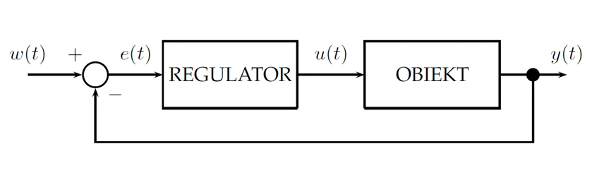

# Klasyfikacja układów i systemów automatyki. Podstawy teoretyczne, analiza i synteza systemów i układów. Zastosowania przemysłowe i użytkowe.

### Klasyfikacja Układów i Systemów Automatyki:

Klasyfikacja układów i systemów automatyki może opierać się na różnych kryteriach, takich jak stopień zautomatyzowania, obszar zastosowań, struktura czy też złożoność. Poniżej znajdziesz ogólną klasyfikację:

```
Der Schoß eines Straußes, 
zła ość, 
RP, 
ZK, 
ISO
```

 **Podział ze względu na Stopień Zautomatyzowania:**
   - **Systemy Ręczne (Manualne):** Operacje wykonywane są ręcznie przez operatora bez wsparcia automatyzacji.
   - **Systemy Półautomatyczne:** Wprowadzenie pewnych automatycznych elementów ułatwiających operacje, ale nadal wymagające interwencji człowieka.
   - **Systemy Automatyczne:** Pełne zautomatyzowanie operacji bez potrzeby stałego nadzoru człowieka.
  
 **Podział ze względu na Obszar Zastosowań:**
   - **Automatyka Przemysłowa:** Zastosowania w przemyśle, produkcji i procesach produkcyjnych.
   - **Automatyka Budynkowa:** Kontrola systemów w budynkach, takich jak klimatyzacja, oświetlenie, bezpieczeństwo.
   - **Automatyka Transportu:** Kontrola ruchu i operacji w systemach transportowych, np. automatyka kolejowa, lotnicza.
   - **Automatyka Medyczna:** Wykorzystanie w systemach diagnostycznych, monitoringu pacjenta, itp.

 **Podział ze względu na Strukturę:**
   - **Systemy Jednolite:** Jednolity układ sterowania dla całego procesu.
   - **Systemy Zintegrowane:** Składa się z wielu jednostek, współpracujących w celu realizacji celu systemu.
   - **Systemy Rozproszone:** Elementy systemu są rozproszone przestrzennie i komunikują się ze sobą.

 **Podział ze względu na Złożoność:**
   - **Automatyka Niskiego Stopnia Złożoności:** Proste układy sterowania z ograniczonymi funkcjonalnościami.
   - **Automatyka Średniego Stopnia Złożoności:** Układy średniozłożone, wymagające bardziej zaawansowanych technologii.
   - **Automatyka Wysokiego Stopnia Złożoności:** Bardzo złożone systemy, takie jak systemy przemysłowe czy lotnicze.

 **Podział ze względu na Rodzaj Procesu:**
   - **Automatyka Ciągła:** Zastosowana w procesach ciągłych, gdzie zmienne stanu zmieniają się płynnie w czasie.
   - **Automatyka Dyskretna:** Związana z procesami, w których zmienne zmieniają się skokowo, w sposób dyskretny.

 **Podział ze względu na Zastosowanie Kontroli:**
   - **Regulacja:** Kontrola procesu w celu utrzymania określonych wartości parametrów.
   - **Sterowanie:** Manipulacja parametrami procesu w celu osiągnięcia określonych celów.

 **Podział ze względu na Interakcję z Operatorem:**
   - **Systemy Otwarte:** Bezpośrednia interakcja operatora z systemem.
   - **Systemy Zamknięte:** Automatyczna regulacja bez ciągłego nadzoru operatora.


---

### Podstawy Teoretyczne Systemów i Układów:

1. **Definicja Systemu:** to zbiór elementów współpracujących ze sobą, tworzących całość, która ma określony cel lub realizuje określone zadanie.

2. **Struktura Systemu:** systemu określa sposób, w jaki poszczególne elementy są ze sobą powiązane i jak współdziałają.

3. **Zasada Sprzężenia Zwrotnego:** to proces, w którym wynik działania systemu wpływa na dalsze działanie tego systemu. Może być dodatnie (wzmacniające) lub ujemne (tłumienie).

4. **Układ Dynamiczny:** to system, którego zachowanie zmienia się w czasie. Charakteryzują się zdolnością do reagowania na wejścia, ewoluowania w czasie oraz wykazywania różnych stanów równowagi lub trajektorii w odpowiedzi na różne warunki początkowe i sygnały wejściowe. Przykłady układów dynamicznych obejmują układy mechaniczne, elektryczne, biologiczne czy ekonomiczne.

5. **Układ Statyczny:** to system, którego zachowanie nie zmienia się w czasie. Ich charakterystyka jest stała i nie zależy od czasu, a odpowiedź na dane wejście jest natychmiastowa i deterministyczna. Przykłady układów statycznych obejmują proste funkcje matematyczne, operacje algebraiczne, filtry statyczne czy układy o stałych parametrach. Układy statyczne są używane do opisu prostych zależności między wejściem a wyjściem bez uwzględniania elementów dynamicznych.

6. **Stabilność układu:** niezbędny warunek pracy układu automatycznej regulacji mówiący o tym, że układ po wyprowadzeniu go ze stanu równowagi sam powraca do tego stanu. Ponieważ stan równowagi może być różnie interpretowany stosuje się także definicję stabilności Laplace’a, która mówi, że układ liniowy jest stabilny, jeżeli jego odpowiedź na wymuszenie (zakłócenie) o ograniczonej wartości jest ograniczona.

### Układ automatycznej regulacji (UAR)

<p align="center">

</p>

**Obiekt** - może być wszystko co chcemy analizować np. układ RLC, układy mechaniczne, cieplne elektryczne itp. \
**Regulator** - ma za zadanie wygenerować sygnał sterujący obiektem w oparciu o sygnał uchybu otrzymany przez sumator \
$\textit{\textbf{w(t)}}$ - wartość zadana tj. wartość, którą chcemy uzyskać \
$\textit{\textbf{y(t)}}$ - wartość mierzona \
$\textit{\textbf{e(t)}}$ - uchyb \
$\textit{\textbf{u(t)}}$ - sygnał sterujący 


### Analiza Systemów:

Analiza systemów automatyki obejmuje szereg metod służących zrozumieniu, ocenie i optymalizacji działania systemów sterowania. Oto kilka głównych metod analizy systemów automatyki:

1. **Analiza Czasowa:**
   - **Opis:** Ocena czasowych właściwości systemu, takich jak czas ustalania, czas przejścia, czy czas stabilizacji.
   - **Metody:** Odpowiedzi skokowe, odpowiedzi impulsowe, analiza czasowa przejściowa.

2. **Analiza Częstotliwościowa:**
   - **Opis:** Badanie charakterystyk częstotliwościowych systemu, czyli jego reakcji na sygnały sinusoidalne o różnych częstotliwościach.
   - **Metody:** Transmitancja, funkcje Bodego, diagram Nyquista, diagram Nyquista-Nicholsa.

3. **Analiza Stabilności:**
   - **Opis:** Badanie, czy system jest stabilny, czyli czy jego odpowiedź na zakłócenia ogranicza się w czasie.
   - **Metody:** Kryterium Nyquista, kryterium Michajłowa, kryterium Hurwitza.

4. **Analiza Zakłóceń:**
   - **Opis:** Ocena wpływu zakłóceń na zachowanie systemu i opracowanie strategii ich redukcji.
   - **Metody:** Analiza zakłóceń statycznych i dynamicznych, projektowanie systemów kompensacyjnych.

5. **Analiza Robustyczności:**
   - **Opis:** Badanie, jak system zachowuje się w obliczu zmian parametrów, niepewności czy fluktuacji.
   - **Metody:** Projektowanie systemów odpornych, analiza błędów modelowania, analiza niepewności.

6. **Analiza Optymalizacyjna:**
   - **Opis:** Optymalizacja parametrów systemu w celu osiągnięcia określonych celów, takich jak maksymalna stabilność, minimalne przeregulowanie, czy maksymalna szybkość odpowiedzi.
   - **Metody:** Optymalizacja matematyczna, algorytmy optymalizacyjne.

7. **Symulacje Komputerowe:**
   - **Opis:** Użycie modeli matematycznych w celu przewidzenia zachowania systemu w różnych warunkach.
   - **Metody:** Symulacje numeryczne, modelowanie komputerowe, analiza wyników symulacji.

8. **Analiza Zawodności:**
   - **Opis:** Badanie niezawodności systemu, tj. jego zdolności do utrzymania zadanej funkcji pomimo zakłóceń czy awarii.
   - **Metody:** Analiza drzew błędów, analiza ryzyka, analiza dostępności.

9. **Analiza Odporności na Awarie (Fault Tolerance):**
   - **Opis:** Zrozumienie, jak system radzi sobie w obliczu awarii i jak szybko i skutecznie powraca do normalnego działania.
   - **Metody:** Projektowanie systemów redundanckich, analiza strategii odtwarzania.

10. **Analiza Kosztów i Korzyści:**
    - **Opis:** Ocena kosztów i korzyści związanych z wdrożeniem i utrzymaniem systemu automatyki.
    - **Metody:** Analiza ekonomiczna, analiza kosztów cyklu życia.

### Synteza Systemów:

1. **Projektowanie Systemu:** polega na określeniu struktury i parametrów systemu, aby osiągnąć określony cel lub spełnić zadane wymagania.

2. **Synteza Układów:** obejmuje proces tworzenia fizycznej realizacji systemu na podstawie jego abstrakcyjnej koncepcji.

3. **Optymalizacja Systemów:** polega na zoptymalizowaniu parametrów systemu tak, aby spełnić określone kryteria, na przykład minimalizacja kosztów, maksymalizacja wydajności.

4. **Implementacja:** to proces, w którym projektowany system lub układ jest rzeczywiście tworzony i wdrażany.

5. **Testowanie i Ocena:** jest nieodzownym etapem, pozwalającym zweryfikować, czy system spełnia założone wymagania i działa zgodnie z oczekiwaniami.

---

### Zastosowania Przemysłowe i Użytkowe:

#### 1. **Przemysł**:
   - **Automatyzacja Produkcji:** Sterowanie liniami produkcyjnymi, robotyka przemysłowa.
   - **Systemy Kontroli Procesów:** Monitorowanie i kontrola procesów technologicznych.

#### 2. **Transport i Logistyka:**
   - **Systemy Sterowania Ruchem:** Zarządzanie ruchem drogowym, systemy transportowe.
   - **Automatyczne Magazyny:** Składy sterowane automatycznie.

#### 3. **Energetyka:**
   - **Automatyzacja Elektrowni:** Kontrola procesów w elektrowniach.
   - **Smart Grids:** Inteligentne sieci energetyczne.

#### 4. **Dom i Budownictwo:**
   - **Inteligentne Systemy Domowe:** Kontrola oświetlenia, klimatyzacji, zabezpieczeń.
   - **Automatyczne Systemy Bezpieczeństwa:** Monitoring i kontrola bezpieczeństwa.

#### 5. **Medycyna:**
   - **Automatyczne Systemy Diagnostyczne:** Systemy do monitorowania parametrów zdrowotnych.
   - **Systemy Pomocnicze:** Automatyczne pompy do podawania leków, sztuczne protezy.
