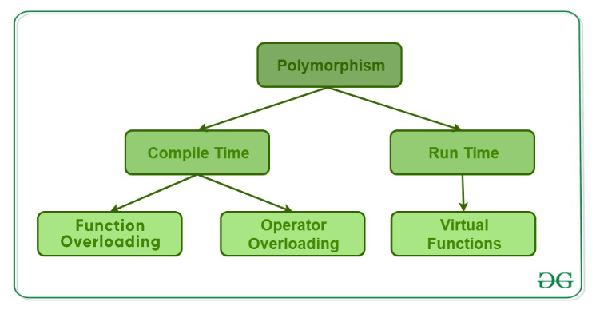

# Omów pojęcia polimorfizmu i enkapsulacji

### **Polimorfizm:**

Polimorfizm to pojęcie związane z obiektowością w programowaniu, które umożliwia traktowanie różnych obiektów w spójny sposób. W skrócie, oznacza to, że różne klasy mogą udostępniać wspólny interfejs, a program może korzystać z tego interfejsu, niezależnie od konkretnej klasy obiektu. Polimorfizm można realizować na dwa główne sposoby: polimorfizm statyczny (lub ad hoc) i polimorfizm dynamiczny (lub wirtualny).



- **Polimorfizm Statyczny (Ad Hoc):** Polega na przeciążaniu funkcji, co oznacza, że jedna funkcja może przyjmować różne typy argumentów. Decyzja o wywołaniu konkretnej funkcji jest podejmowana w czasie kompilacji na podstawie typów argumentów*.

```cpp
// Przykład w języku C++
int dodaj(int a, int b) {
    return a + b;
}

double dodaj(double a, double b) {
    return a + b;
}

int wynik1 = dodaj(2, 3);        // wywołuje funkcję dodaj(int, int)
double wynik2 = dodaj(2.5, 3.5); // wywołuje funkcję dodaj(double, double)
```

- **Polimorfizm Dynamiczny (Wirtualny):**
Polega na zastosowaniu **mechanizmu dziedziczenia i wskaźników lub referencji do bazowej klasy**. Decyzja o wywołaniu konkretnej funkcji jest podejmowana w czasie wykonania na podstawie rzeczywistego typu obiektu.

```cpp
// Przykład w języku C++
class Figura {
public:
    virtual void rysuj() {
        // Implementacja rysowania dla Figury
    }
};

class Kwadrat : public Figura {
public:
    void rysuj() override {
        // Implementacja rysowania dla Kwadratu
    }
};

class Kolo : public Figura {
public:
    void rysuj() override {
        // Implementacja rysowania dla Koła
    }
};

Figura* obiekt1 = new Kwadrat();
Figura* obiekt2 = new Kolo();

obiekt1->rysuj(); // wywołuje rysuj() dla Kwadratu
obiekt2->rysuj(); // wywołuje rysuj() dla Koła
```


## **Enkapsulacja:**

Enkapsulacja to jeden z fundamentów paradygmatu obiektowego, który polega na ukrywaniu implementacji danych wewnątrz klasy i udostępnianiu dostępu do nich tylko za pomocą zdefiniowanych interfejsów. Celem enkapsulacji jest izolowanie detali implementacyjnych, co pozwala na łatwiejsze zarządzanie kodem, zwiększa bezpieczeństwo i umożliwia zmiany wewnętrznej implementacji bez wpływania na zewnętrzny kod korzystający z klasy.

- **Ukrywanie Implementacji:** Dostęp do pól i metod prywatnych jest ograniczony tylko do klasy, w której zostały zdefiniowane.


```cpp
#include <iostream>

// Klasa bazowa
class KlasaBazowa {
protected:
    int zmiennaChroniona;

public:
    KlasaBazowa() : zmiennaChroniona(0) {}

    void ustawWartosc(int nowaWartosc) {
        zmiennaChroniona = nowaWartosc;
    }

    void wyswietlWartosc() {
        std::cout << "Wartosc zmiennej chronionej: " << zmiennaChroniona << std::endl;
    }
};

// Klasa pochodna dziedzicząca publicznie z KlasyBazowej
class KlasaPochodna : public KlasaBazowa {
public:
    void podniesWartosc() {
        // Możemy korzystać z zmiennejChronionej w klasie pochodnej
        zmiennaChroniona++;
    }
};

int main() {
    KlasaPochodna obiekt;

    // Dostęp do funkcji publicznych z KlasyBazowej
    obiekt.ustawWartosc(42);
    obiekt.wyswietlWartosc();

    // Dostęp do funkcji i zmiennej chronionej z KlasyBazowej
    obiekt.podniesWartosc();
    obiekt.wyswietlWartosc();

    return 0;
}
```

- **Dostęp przez Interfejs Publiczny:** Dostęp do funkcji publicznych umożliwia bezpieczne manipulowanie danymi obiektu.

Enkapsulacja pomaga w zapewnieniu bezpieczeństwa danych, umożliwia lepsze zarządzanie kodem oraz ułatwia utrzymanie i rozwijanie aplikacji.
