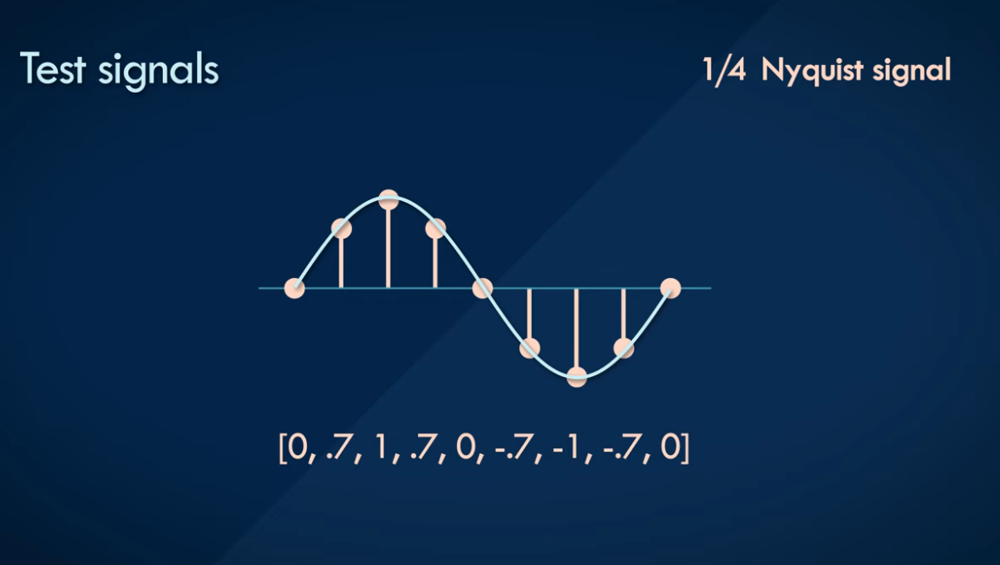
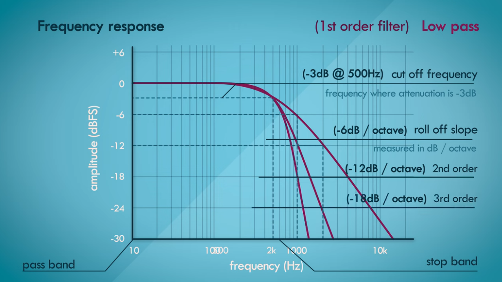
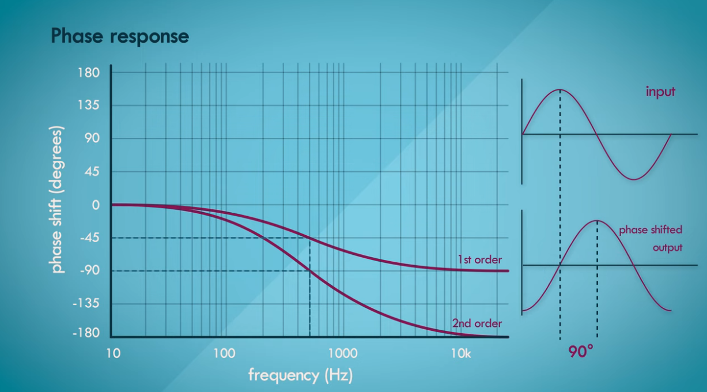
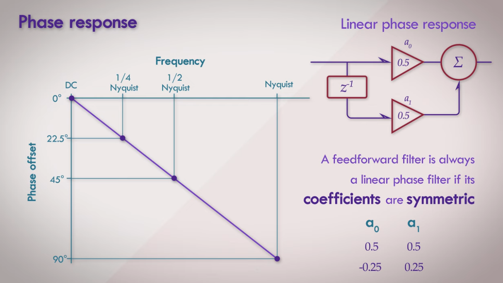
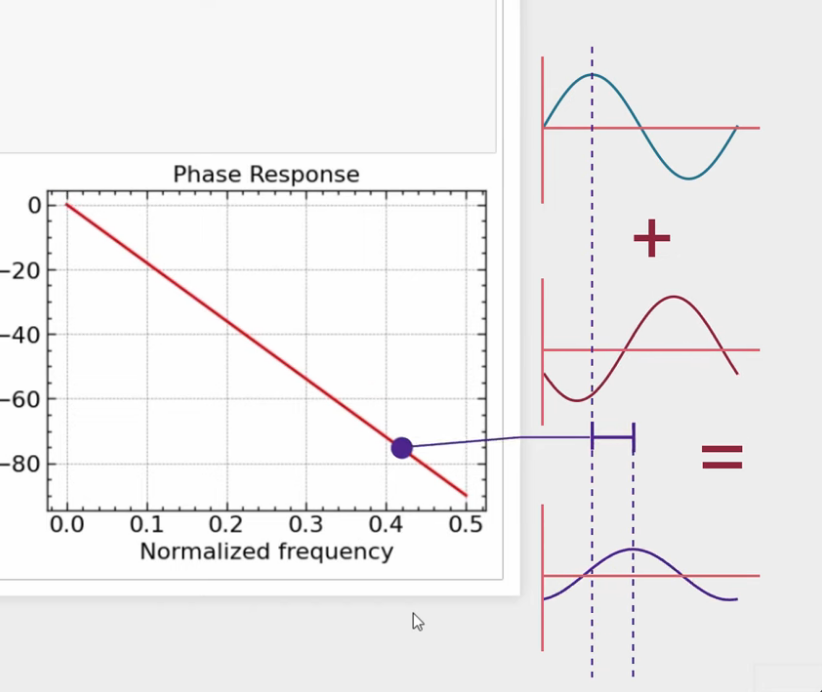
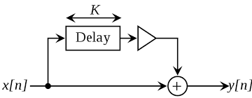
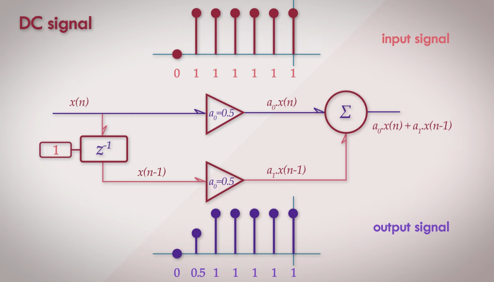

# Filtry cyfrowe; rodzaje filtrów, specyfikacja własności filtrów, metody projektowania

https://www.youtube.com/watch?v=Qmd685msY-Y&list=PLbqhA-NKGP6Afr_KbPUuy_yIBpPR4jzWo

**Cyfrowy układ sekwencyjny**, który w reakcji na ciąg próbek **sygnału dyskretnego** podanego na wejście odpowiada ciągiem próbek wyjściowych, zgodnie z **deterministyczną funkcją przejścia** (zdarzeniu jednoznacznie przypisuje konkretny stan), która może być liniowa lub nieliniowa.

W przypadku filtru liniowego jego właściwości całkowicie określa dyskretna odpowiedź impulsowa, a sygnał wyjściowy jest splotem dyskretnym sygnału wejściowego z tą odpowiedzią. W dziedzinie częstotliwości właściwości takiego filtru opisuje transmitancja.

Zachowanie dynamiczne filtru nieliniowego jest zazwyczaj bardziej skomplikowane, dlatego odpowiedź impulsowa takiego filtru nie opisuje wszystkich jego właściwości i nie wystarcza do przewidzenia reakcji filtru na dowolny sygnał wejściowy.

Odpowiedź impulsowa w filtrach cyfrowych odnosi się do reakcji filtra na impuls jednostkowy (delta Diraca) podany na jego wejście. Jest to fundamenty element analizy i projektowania filtrów cyfrowych. Odpowiedź impulsowa jest szczególnie użyteczna, ponieważ pozwala zobaczyć, jak filtr reaguje na bardzo krótki, impulsowy sygnał, co daje informacje na temat charakterystyki częstotliwościowej i czasowej filtru.

Odpowiedź impulsowa jest również używana do uzyskiwania charakterystyk filtru w dziedzinie częstotliwości za pomocą transformaty Fouriera lub transformaty Z, co pozwala na analizę jego właściwości w dziedzinie częstotliwości.

Częstotliwość Nyquista jest równa połowie częstotliwości próbkowania:

Filtry cyfrowe można podzielić na dwie grupy:

- Filtry o skończonej odpowiedzi impulsowej (SOI, ang. finite impulse response – FIR)
- Filtry o nieskończonej odpowiedzi impulsowej (NOI, ang. infinite impulse response – IIR)

$f_{N}=f_{s}/2$  albo  $f_{N}=1/{2T_{s}}$

### Reakcja na częstotliwość

### Charakterystyka fazowa

## Rodzaje filtrów

### Filtry FIR

Filtr o skończonej odpowiedzi impulsowej. Oznacza, że reakcja na wyjściu tego układu na pobudzenie o skończonej długości jest również skończona (przez długość pobudzenia i odpowiedzi rozumie się długość odcinka czasu, dla którego próbki sygnału przyjmują wartości niezerowe). 

Filtry FIR są obecnie częściej stosowane niż IIR z powodu następujących zalet:

- Projektowanie filtrów FIR jest znacznie łatwiejsze niż filtrów IIR.

- Filtry FIR są zawsze stabilne, gdyż w ich funkcji transmitancji występują tylko zera, więc nie ma rekursywności mogącej spowodować niestabilność.

- Łatwo jest uzyskać w tego typu filtrach liniową fazę, filtry z liniową fazą opóźniają wszystkie składowe sygnału w jednakowym stopniu.

Jedynymi, choć istotnymi, wadami filtrów FIR w porównaniu do IIR są:

- większa złożoność obliczeniowa,
- większe zapotrzebowania na pamięć operacyjną.

### Filtry IIR

Rodzaj filtru cyfrowego, który w odróżnieniu od filtrów FIR jest układem rekursywnym. IIR oznacza nieskończoną odpowiedź impulsową. Reakcja na pobudzenie o skończonym czasie trwania jest teoretycznie nieskończenie długa. Jest to efektem występowania pętli sprzężenia zwrotnego

Ze względu na dużą elastyczność w kształtowaniu przebiegu funkcji za pomocą **ilorazu wielomianów**, znacznie łatwiej uzyskać pożądaną charakterystykę używając filtru IIR niskiego rzędu niż filtru FIR. Wynikają z tego dwie podstawowe zalety filtrów IIR w porównaniu do FIR:

- niska złożoność obliczeniowa,
- niewielkie zapotrzebowanie na pamięć operacyjną.

Te zalety spowodowały duże zainteresowanie filtrami IIR i burzliwy rozwój teorii ich projektowania w latach 70. XX w., które przypadają na początki rozwoju technik cyfrowego przetwarzania sygnałów, gdy nie były dostępne procesory o odpowiedniej mocy obliczeniowej.

Do wad filtrów IIR należy zaliczyć:

- Rekursywność filtru wprowadza potencjalne zagrożenie utraty stabilności (odpowiedź filtru w sposób niekontrolowany narasta do nieskończoności); niestabilność może mieć miejsce wtedy, gdy bieguny transmitancji (miejsca zerowe wielomianu w mianowniku) znajdą się poza okręgiem jednostkowym na płaszczyźnie zespolonej.
- Projektowanie filtrów IIR jest znacznie trudniejsze niż w przypadku filtrów FIR – nie tylko ze względu na dodatkowy warunek zapewnienia stabilności.
- Filtry IIR są znacznie bardziej wrażliwe na błędy zaokrągleń: zaokrąglenia wartości współczynników mogą znacząco zmienić charakterystykę, a zaokrąglenia wartości sygnału i wyników pośrednich wprowadzają szum, który może się akumulować.
- Nie można ich zaimplementować jako filtrów o liniowej fazie, czyli takich, które wprowadzają takie samo opóźnienie grupowe dla wszystkich składowych częstotliwościowych przepuszczanego sygnału.
- Z uwagi na rosnącą wydajność układów cyfrowych i procesorów sygnałowych, filtry IIR nie są obecnie tak chętnie wykorzystywane jak dawniej, a największą popularnością cieszą się filtry FIR, które nie mają wyżej wymienionych wad.

## Metody projektowania

Projektowanie filtrów cyfrowych to proces określania charakterystyk filtra, takich jak **częstotliwość, wzmocnienie, opóźnienie grupowe, szerokość pasma i tłumienie sygnału**, aby spełnić konkretne wymagania aplikacji. Istnieje kilka metod projektowania filtrów cyfrowych, z których najpopularniejsze to:

1. **Projektowanie filtrów w dziedzinie czasu (FIR):**

   - **Projektowanie impulsowe (Window Method):** Polega na wymnożeniu odpowiedzi impulsowej idealnego filtra przez okno czasowe, takie jak okno prostokątne, Hamminga, Hanninga itp. Zastosowanie okna wprowadza pewne kompromisy między szerokością pasa przenoszenia a tłumieniem sygnału.
   
   - **Projektowanie za pomocą algorytmu Parks-McClellan (Remez Algorithm):** Minimalizuje różnicę między charakterystyką filtra a idealną charakterystyką w miejscach określonych przez użytkownika. Jest skuteczny w projektowaniu filtrów o dowolnej charakterystyce, ale może być bardziej złożony obliczeniowo.

2. **Projektowanie filtrów w dziedzinie częstotliwości (IIR):**

   - **Projektowanie za pomocą transformacji częstotliwości:**  Przekształca charakterystyki filtrów analogowych do dziedziny cyfrowej. Często używa się transformacji częstotliwości, takich jak transformacja częstotliwościowa bilinowa, aby przenieść filtry analogowe na cyfrowe.
   
   - **Projektowanie filtrem Butterwortha:** Filtry Butterwortha charakteryzują się płaską charakterystyką przenoszenia w paśmie przepustowym, co oznacza, że mają równomierne tłumienie w tej częstotliwości. Są stosunkowo łatwe do zrealizowania, ale mają duże opóźnienie grupowe w paśmie przenoszenia.
   
   - **Projektowanie filtrem Chebysheva:** Filtry Chebysheva charakteryzują się mniejszym opóźnieniem grupowym niż filtry Butterwortha, ale mają nieregularną charakterystykę przenoszenia w paśmie przepustowym. Pozwala to na większe wzmocnienie w paśmie przenoszenia kosztem pewnych nieregularności.

3. **Projektowanie adaptacyjne:**

   - **Algorytmy adaptacyjne:** W tym przypadku filtry są dostosowywane do zmieniających się warunków sygnału wejściowego. Przykładem jest filtr LMS (Least Mean Squares), który minimalizuje średnią kwadratów różnic między sygnałem wejściowym a sygnałem wyjściowym filtra.

4. **Projektowanie filtrów dla zastosowań specjalnych:**
   - **Projektowanie filtrów wielopasmowych:** Filtry wielopasmowe mają wiele pasm przenoszenia i tłumienia, co jest przydatne w aplikacjach, gdzie sygnał składa się z kilku składowych o różnych częstotliwościach.
   
   - **Projektowanie filtrów adaptacyjnych:** Filtry adaptacyjne zmieniają swoje charakterystyki w czasie rzeczywistym w odpowiedzi na zmiany warunków sygnału wejściowego.

## Dodadkowe rodzaje filtrów

Rodzaje filtrów cyfrowych można podzielić na kilka głównych kategorii, zależnie od ich charakterystyki i sposobu przetwarzania sygnałów. Oto kilka głównych rodzajów filtrów cyfrowych:

1. **Filtr dolnoprzepustowy (Low-pass filter):** Przepuszcza częstotliwości poniżej pewnej wartości granicznej, a tłumi częstotliwości powyżej tej wartości. Wykorzystywany do eliminacji składowych wysokich częstotliwości.

2. **Filtr górnoprzepustowy (High-pass filter):** Przepuszcza częstotliwości powyżej pewnej wartości granicznej, a tłumi częstotliwości poniżej tej wartości. Stosowany do eliminacji składowych niskich częstotliwości.

3. **Filtr pasmowoprzepustowy (Band-pass filter):** Przepuszcza sygnały w określonym pasmie częstotliwości. Wykorzystywany, gdy interesujące są sygnały znajdujące się w określonym zakresie częstotliwości.

4. **Filtr pasmowozaporowy (Band-stop filter lub Notch filter):** Tłumi sygnały w określonym pasmie częstotliwości. Stosowany, gdy istnieją zakłócenia lub sygnały, które należy wyeliminować.

5. **Filtr adaptacyjny:** Zdolny dostosowywać swoje parametry w czasie rzeczywistym w celu skutecznego filtrowania sygnałów zmiennych w czasie.

6. **Filtr Kalmana:** Wykorzystywany w układach kontroli i filtracji sygnałów, zwłaszcza w przypadku estymacji stanu systemu dynamicznego.

7. **Filtr medianowy:** Wykorzystuje medianę (wartość środkową) do redukcji szumów i zakłóceń w sygnałach.

8.  **Filtr wielopoziomowy (Multirate filter):**
 Zawiera więcej niż jedno pasmo przenoszenia i wykorzystuje techniki wielopoziomowego przetwarzania sygnałów.

9. **Filtr grzebieniowy**: Jego działanie polega na dodawaniu sygnału do jego opóźnionej wersji, co powoduje wzmacnianie, bądź wygaszanie poszczególnych składowych częstotliwościowych poprzez zjawisko interferencji.

 
  

