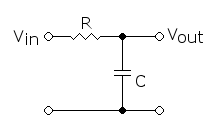
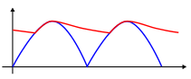
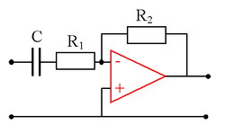

# Filtr (elektronika)

**Filtr** – fragment obwodu elektrycznego lub obwodu elektronicznego odpowiedzialny za przepuszczanie lub blokowanie sygnałów w określonym zakresie częstotliwości lub zawierającego określone harmoniczne.

Ze względu na przeznaczenie filtry można podzielić na cztery podstawowe rodzaje:

- dolnoprzepustowe,
- górnoprzepustowe,
- środkowoprzepustowe,
- środkowozaporowe.

Ze względu na konstrukcję i rodzaj działania filtry można podzielić na:

- pasywne – nie zawierają elementów dostarczających energii do obwodu drgającego, zawierają tylko elementy RLC:
  - jednostopniowe,
  - wielostopniowe,
- aktywne – zawierają zarówno elementy RLC, jak również i elementy dostarczające energię do filtrowanego układu np. wzmacniacze, układy nieliniowe.

## Filtry pasywne
Najprostszym rodzajem filtra pasywnego, szeroko stosowanego w elektronice, jest filtr dolnoprzepustowy w postaci kondensatora o dużej pojemności połączonego równolegle do filtrowanego napięcia (z ewentualnym szeregowym opornikiem). Urządzenia elektroniczne są często zasilane z sieci energetycznej za pomocą zasilaczy, w których napięcie sieci (o skutecznej wartości 230 V) jest transformowane na niskie napięcie użyteczne (np. 12 V), które jest następnie prostowane za pomocą prostownika dwupołówkowego. Napięcie wyjściowe takiego prostownika ma przebieg tętniący (zobacz rysunek). Dopiero równoległe dołączenie kondensatora o odpowiedniej pojemności powoduje znaczne zmniejszenie amplitudy tętnień, czyli proces filtrowania. Im większa jest pojemność użytego kondensatora, tym napięcie wyjściowe ma przebieg bardziej zbliżony do przebiegu stałego.

 
  

    
    
Pasywny filtr dolnoprzepustowy zrealizowany z opornika i kondensatora

  

  

    
    

      Filtrowanie napięcia tętniącego za pomocą pasywnego filtra dolnoprzepustowego
    

  

Jeśli w powyższym układzie elementy C i R zostaną zamienione, wówczas powstanie pasywny filtr górnoprzepustowy.

W obu przypadkach częstotliwość graniczna filtru wynosi: 
$f_{g}={\frac {1}{2\pi RC}}$ a charakterystyka amplitudowa w paśmie tłumienia opada o 20 dB na dekadę.

Przy dużych natężeniach prądu obok kondensatorów stosuje się cewki włączone szeregowo z odbiornikiem, zwane w takim przypadku dławikami. Zmiany prądu w cewce wywołują powstanie napięcia przeciwdziałającego tym zmianom, a tym samym wygładzenie przebiegu napięcia.

Para elementów LC dostrojonych do określonej częstotliwości będzie się zachowywać, w zależności od sposobu włączenia do układu, jak filtr środkowoprzepustowy (używany np. do strojenia radiowych odbiorników AM) lub jak filtr środkowozaporowy (używany do tłumienia niepożądanego pasma częstotliwości).

## Filtry aktywne

Filtry aktywne zazwyczaj wykorzystują również własności elementów RLC, ale przy wspomaganiu specjalnymi elementami sterującymi oraz dostarczającymi energię do filtrowanego układu. Dzięki temu filtry aktywne charakteryzują się znacznie lepszym tłumieniem w paśmie zaporowym niż filtry pasywne.

Przykład górnoprzepustowego aktywnego filtra przedstawiono na rysunku poniżej. Filtr taki bazuje na wzmocnionych charakterystykach elementów RC. Elementem aktywnym jest tutaj wzmacniacz operacyjny, który posiada odrębne zasilanie (nie pokazane dla czytelności rysunku), i który powoduje częściowe dostarczanie energii do filtrowanego układu.

 
  

    
    

      Przykład aktywnego filtra górnoprzepustowego (wzmacniacz operacyjny zaznaczono czerwonym kolorem)
    

  

Istnieje wiele różnych typów filtrów aktywnych, m.in.:

- filtry Butterwortha,
- filtry Czebyszewa,
- filtry Bessela,
- filtry eliptyczne.

