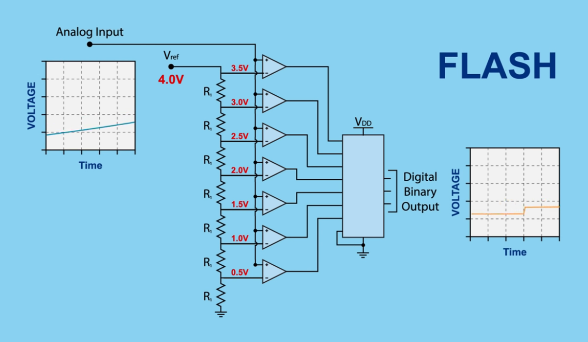
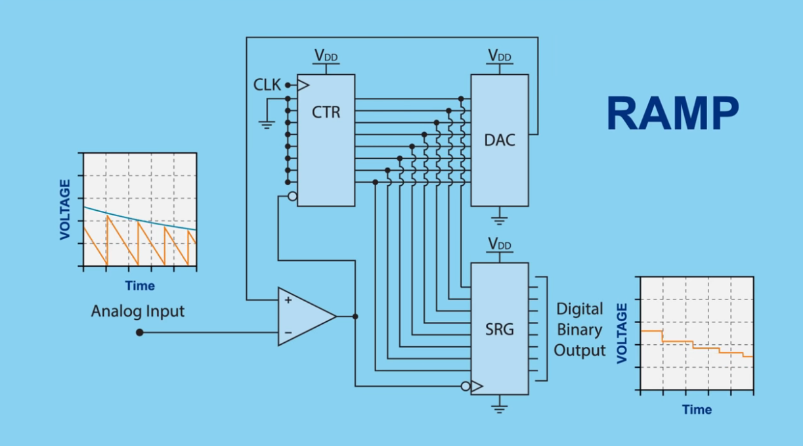
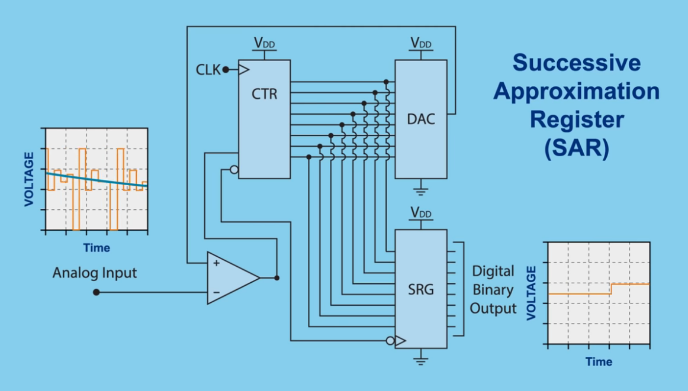
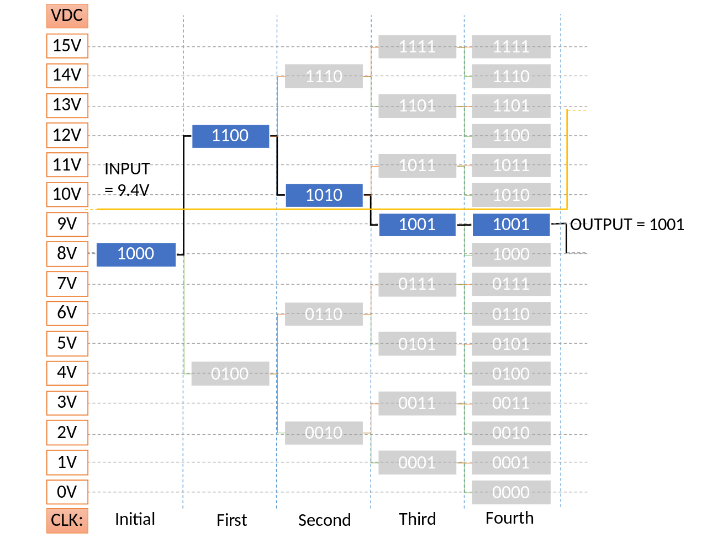
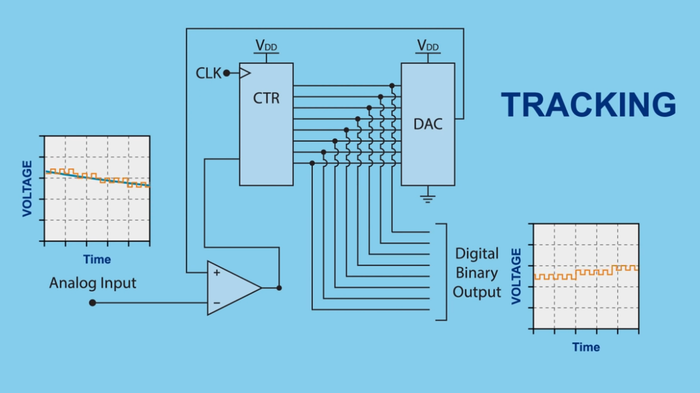
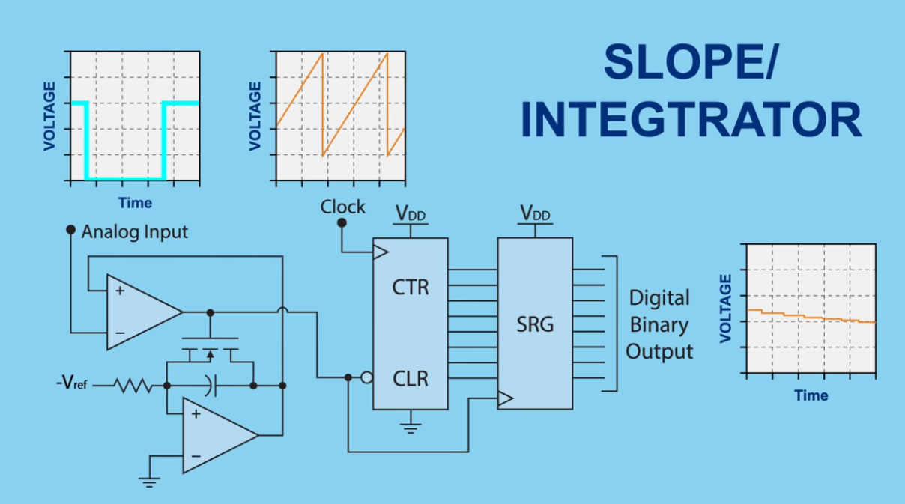
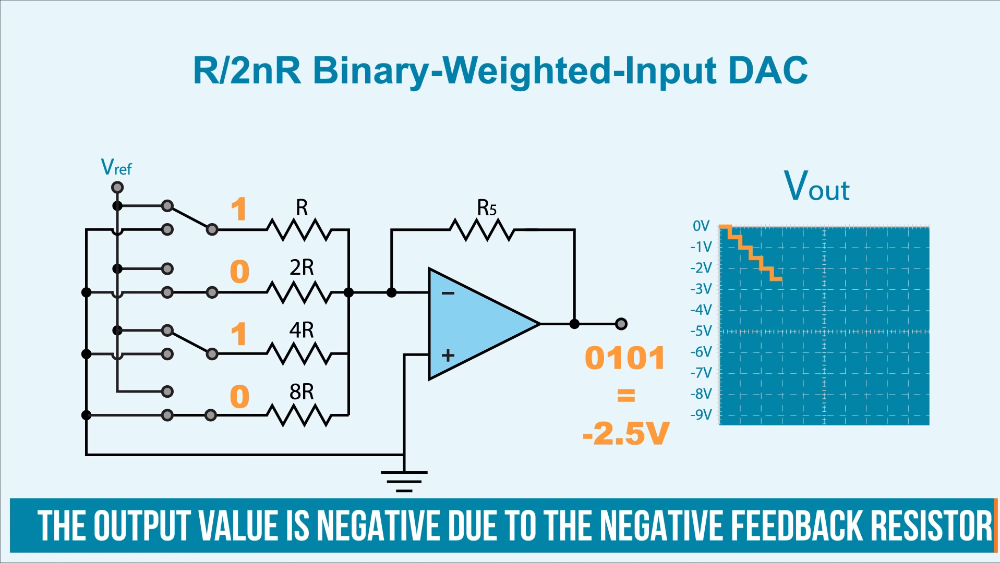
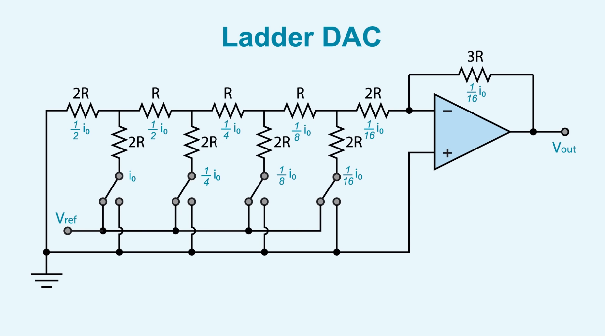

# Przetworniki analogowo-cyfrowe i cyfrowo-analogowe; rodzaje przetworników, własności i zastosowania

### Przetworniki Analogowo-Cyfrowe (ADC):

Przetwornik analogowo-cyfrowy A/C (ADC – analog to digital converter) – układ służący do zamiany sygnału analogowego na sygnał cyfrowy. Dzięki temu możliwe jest przetwarzanie ich w urządzeniach elektronicznych opartych o architekturę zero-jedynkową oraz gromadzenie na dostosowanych do tej architektury nośnikach danych. Proces ten polega na uproszczeniu sygnału analogowego do postaci skwantowanej (dyskretnej), czyli zastąpieniu wartości zmieniających się płynnie do wartości zmieniających się skokowo w odpowiedniej skali (dokładności) odwzorowania. Przetwarzanie A/C tworzą 3 etapy: 

<h3 align="center">
próbkowanie, kwantyzacja i kodowanie. 
</h3>

### Rodzaje:

1. **Przetwornik o porównaniu bezpośrednim (Flash)** - dokonuje jednoczesnego porównania wartości napięcia wejściowego z szeregiem napięć odniesienia za pomocą **komparatorów analogowych**. Wyniki porównań są przekazywane do enkodera, który zamienia te informacje na postać binarną. Zaletą tego typu przetwornika jest wysoka szybkość działania, jednakże wiąże się to z mniejszą rozdzielczością i dokładnością w porównaniu do innych typów.

  

  
  

2. **Przetwornik z próbkowaniem analogowym (RAMP)** - opiera się na zliczaniu impulsów z generatora wzorcowego proporcjonalnie do napięcia wejściowego. Szerokość impulsu bramkującego, generowanego na podstawie porównania napięcia wejściowego z narastającym napięciem odniesienia, wpływa na czas zliczania impulsów. Szybkość przetwarzania tego typu przetworników zależy od częstotliwości generowanego impulsu wzorcowego, a rozdzielczość od szerokości bitowej licznika.

  

  
  

  **CTR** - Counter or Register \
  **DAC** - Digital-to-Analog Converter \
  **SRG** - Shift Register (Rejestr przesuwający)

3. **Przetwornik z sukcesywną aproksymacją (SAR)** - stosuje iteracyjny proces porównywania napięcia wejściowego z napięciem odniesienia generowanym przez przetwornik cyfrowo-analogowy. Układ sterujący ustawia kolejne bity słowa danych, zaczynając od najważniejszego, w zależności od wyników porównań. Proces ten trwa aż do osiągnięcia ostatniego bitu słowa danych. Jego częstotliwość próbkowania jest znacząco niższa od przetworników o przetwarzaniu bezpośrednim.

  

  
  

  

  
  

  

  
  

4. **Przetwornik podwójnie całkujący** - jest jednym z najdokładniejszych sposobów przetwarzania sygnału analogowego na cyfrowy. Zamienia on wartość średnią napięcia mierzonego na czas całkowania. W pierwszym cyklu całkowania napięcie wejściowe jest integrowane, a w drugim do integratora dodawane jest napięcie wzorcowe o przeciwnym znaku. Licznik zlicza impulsy z generatora zegarowego, a proces jest powtarzany do momentu osiągnięcia zera przez napięcie wejściowe.

  

  
  

5. **Przetworniki o architekturze potokowej** - nie stanowią oddzielnego typu, ale wykorzystują wcześniej opisane rodzaje przetworników. Bazują na potokowym przetwarzaniu danych, co oznacza równoczesne przetwarzanie wielu próbek przez różne etapy przetwarzania. To podejście pozwala na zwiększenie efektywności i szybkości przetwarzania danych.

### Własności

1. **Rozdzielczość** przetwornika określa liczbę dyskretnych wartości jakie może on wytworzyć. Zwykle wyraża się ją w bitach. Przykładowo, przetwornik A/C, który potrafi przetworzyć próbkę sygnału na jedną z 256 wartości liczbowych posiada rozdzielczość równą 8 bitów, ponieważ $2^{8}=256$

    Rozdzielczość może być również wyrażona w woltach. Rozdzielczość napięcia przetwornika A/C jest równa jego całkowitej skali pomiaru podzielonej przez liczbę poziomów kwantyzacji:

    ### Przykład:
    - Pełna skala pomiaru to od -10 do 10 woltów.
    - Rozdzielczość przetwornika jest równa 8 bitów, czyli $2^{8}=256$ poziomów kwantyzacji
    - Rozdzielczość napięciowa wynosi: $(10–(-10)/256 = 0,078125V = 78,125 mV$

1. **Nieliniowość całkowita** (ang. integral nonlinearity) jest określana jako maksymalna różnica *$(\Delta U_I)_{max}$* napięcia wejściowego pomiędzy rzeczywistą charakterystyką przetwarzania $N = f(U_I)$ a charakterystyką idealną, odniesiona do maksymalnej wartości napięcia przetwarzania $Umax$, wyrażona w procentach. Charakterystykę idealną wyznacza się jako prostą łączącą skrajne punkty zakresu przetwarzania, charakterystykę rzeczywistą natomiast jako linię łączącą środki przedziałów napięcia $U_I$ odpowiadających kolejnym wartościom cyfrowym na wyjściu przetwornika
    
    $$\varepsilon _{r}=\pm {\frac {\left(\Delta U_{I}\right)_{max}}{U_{max}}}\times 100\%$$

2. **Nieliniowość różniczkowa** (ang. differential nonlinearity) określa się przez wyznaczenie różnic między sąsiednimi wartościami napięcia wyjściowego, wywołanych zmianą słowa wejściowego o wartość najmniej znaczącego bitu. Określa więc błąd jednorodności szerokości kanałów przetwornika. Nieliniowość różniczkowa jest podawana w procentach jako maksymalna różnica pomiędzy szerokością kanału rzeczywistego $U_{r}$ a szerokością kanału nominalnego, $U_{n}$ odniesiona do szerokości nominalnej. $U_{n}$. 

    $$\varepsilon _{d}=\pm {\frac {\left|U_{r}-U_{n}\right|_{max}}{U_{n}}}\times 100\%$$

3. **Błąd przesunięcia zera (błąd niezrównoważenia)** jest określany przez wartość napięcia wejściowego potrzebną do przejścia od zerowej wartości słowa wyjściowego do następnej większej wartości. Błąd ten jest mierzony jako przesunięcie w stosunku do charakterystyki idealnej. Należy podkreślić, że wartość błędu przesunięcia zera jest rzadko podawana w katalogach, gdyż jest możliwa całkowita kompensacja tego błędu w większości nowoczesnych przetworników.

### Zastosowania:

1. **Systemy Pomiarowe** - Wprowadzanie sygnałów analogowych, takich jak temperatura, ciśnienie, czy natężenie prądu, do systemów komputerowych.

2. **Komunikacja Radiowa i Telewizyjna** - Konwersja sygnałów radiowych i telewizyjnych na formę cyfrową dla lepszego przetwarzania i transmisji.

3. **Aparatura Audio** - Konwersja dźwięku analogowego na cyfrowy w urządzeniach audio, takich jak mikrofony, karty dźwiękowe, itp.

4. **Systemy Sterowania** - Zastosowanie w systemach sterowania, gdzie sygnały analogowe są przekształcane na dane cyfrowe dla skomputeryzowanej analizy i regulacji.

---

### Przetworniki Cyfrowo-Analogowe (DAC):

Przetwornik C/A lub DAC (z ang. Digital to Analog Converter, DAC) – przyrząd elektroniczny przetwarzający sygnał cyfrowy na sygnał analogowy w postaci prądu elektrycznego lub napięcia o wartości zależnej od sygnału cyfrowego. Działanie odwrotne wykonuje przetwornik analogowo-cyfrowy A/C.

### Rodzaje: 

Istnieje kilka rodzajów przetworników cyfrowo-analogowych (DAC), z których każdy ma swoje własne cechy i zastosowania. Oto kilka głównych rodzajów przetworników DAC:

1. **Binary Weighted Input (R/2nR) DAC:** 
Jest to podstawowy rodzaj DAC, w którym każdemu bitowi przypisana jest wartość wagowa zgodna z potęgami dwójki. Jest prosty i skuteczny, ale może wymagać precyzyjnych rezystorów, aby uzyskać dokładność.

  

  
  

1. **R-2R DAC:** 
W tym typie DAC stosuje się sieć rezystorów o wartościach R i 2R. Ten rodzaj DAC jest odporny na błędy wynikające z tolerancji rezystorów, a także umożliwia łatwe skalowanie. Jest szeroko stosowany ze względu na swoją dokładność.

  

  
  

3. **Łańcuchowy (String DAC):** 
W DAC Łańcuchowym każdy bit ma własny rezystor, a napięcia wyjściowe są sumowane. To podejście umożliwia osiągnięcie dużej rozdzielczości, ale może być kosztowne i złożone.

4. **Czasowo-Próbkowy (Time-Interleaved DAC):** 
Ten rodzaj DAC używa kilku przetworników pracujących równocześnie w trybie czasowo-próbkowym. Działa to na zasadzie przeplatanie (interleaving), co zwiększa przepustowość i umożliwia obsługę wyższych częstotliwości próbkowania.

5. **Potencjometryczny:** 
W DAC Potencjometrycznym stosuje się potencjometry, aby kontrolować napięcia wyjściowe. Jest to stosunkowo prosty sposób na uzyskanie precyzyjnego sterowania napięciem, ale może być wolniejszy niż inne metody.

6. **Prądowy:** 
W DAC Prądowym napięcia są przekształcane na prądy, a następnie sumowane. Ten rodzaj DAC jest często stosowany w układach mikroelektroniki, zwłaszcza w aplikacjach analogowych.

7. **Delta-Sigma:** 
DAC Delta-Sigma jest często stosowany w przetwornikach sygnałów dźwiękowych i w innych zastosowaniach wymagających wysokiej jakości dźwięku. Wykorzystuje modulację delta-sigma do osiągnięcia wysokiej rozdzielczości.

8. **Przetwornika Pipelined:** 
Ten rodzaj DAC wykorzystuje wiele stopni przetwarzania w rurkach (pipelines) i jest efektywny przy wysokich częstotliwościach próbkowania.

### Własności 

1. **Rozdzielczość** – maksymalna liczba możliwych dyskretnych wartości jakie może on wytworzyć. Zwykle rozdzielczość określona jest jako liczba bitów, która jest podstawą z 2 logarytmów z wartości liczbowej. Przykładowo 1-bitowy przetwornik C/A jest zaprojektowany do reprodukcji dwóch $(2^{1})$ wartości, z kolei 8-bitowy już 256.
$(2^{8}).$ Rozdzielczość jest powiązana z Efektywną Liczbą Bitów (ENOB – z ang. Effective Number of Bits) która jest pomiarem rzeczywistej rozdzielczości przetwornika. Rozdzielczość może być również wyrażona w woltach.

2. **Maksymalna częstotliwość próbkowania** – maksymalna prędkość dla której obwód przetwornika C/A jest w stanie pracować i produkować stały poprawny sygnał na wyjściu. W praktyce nie jest możliwe dokładne odtworzenie samego sygnału na podstawie wygenerowanych wartości liczbowych ze względu na błąd kwantyzacji. **Wiarygodne odwzorowanie sygnału jest możliwe wtedy gdy częstotliwość próbkowania jest dwukrotnie większa od najwyższej częstotliwości składowej sygnału. Zgodnie z twierdzeniem Katielnikova-Shannona.**
3. **Monotoniczność** – zdolność wyjścia analogowego przetwornika C/A do wzrostu wraz ze wzrostem w kodzie cyfrowym lub odwrotnie. Ta właściwość jest ważna dla przetwornika ze względu na możliwość zastosowania go wraz ze słabej częstotliwości sygnałem na wejściu.
4. **THD+N** (Współczynnik zawartości harmonicznych z ang. Total harmonic distortion) – stosunek wartości skutecznej wyższych harmonicznych sygnału, do wartości skutecznej składowej podstawowej. Współczynnik zawartości harmonicznych często podaje się w procentach.
5. **Skala dynamiki D.R** (z ang.Dynamic Range) – wartość w $dB$ jako różnica największego i najmniejszego sygnału jaki przetwornik C/A jest w stanie wytworzyć. Wartość zależna od rozdzielczości przetwornika przykładowo dla CD-Audio 16 bitów wynosi maksymalnie $96,32959861$ ${\text{dB}}$ a można ją obliczyć w następujący sposób 
    $$D.R=20log(2^n)$$ 
    gdzie $n$ – liczba bitów dla CD $20 \log(2^{16})=20 \log(65536)=20*4,8164799$

### Zastosowanie 

1. **Sprzęt audio** - Przetworniki C/A znalazły szerokie zastosowanie w odtwarzaczach audio. W dzisiejszych czasach większość sygnałów audio jest przechowywana w postaci cyfrowej (np. format MP3 czy audio CD). Aby można było je usłyszeć w głośnikach należy je najpierw przekonwertować na sygnał analogowy.

2. **Sprzęt wideo** - Sygnał z cyfrowych urządzeń (takich jak np. komputer, kamera, odtwarzacz CD/DVD/Blu-ray, dekoder telewizji satelitarnej itd.) musi zostać przekonwertowany na sygnał analogowy zanim będziemy mogli zobaczyć go na ekranie telewizora lub ekranie rzutnika. Od pewnego czasu analogowe wyjścia zastępują ich cyfrowe odpowiedniki (np. DVI, HDMI i inne), zmienia się w ten sposób miejsce przetwarzania sygnału cyfrowego na analogowy. Im tor analogowy jest krótszy, tym mniej zakłóceń w postaci szumów i zniekształceń jest wnoszonych do sygnału.
