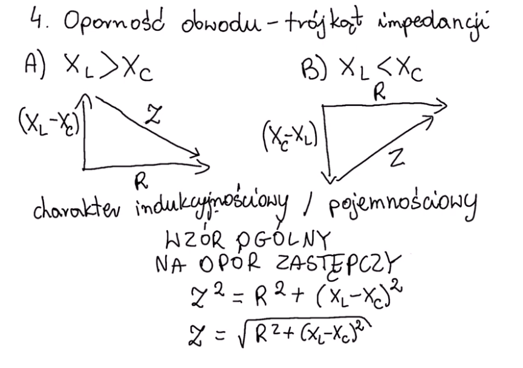
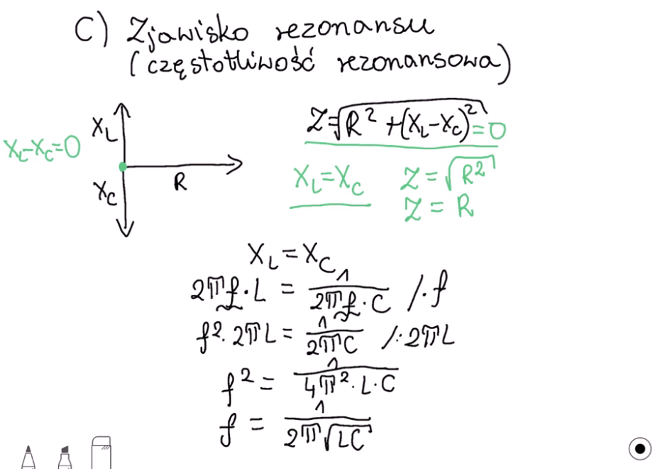

# Opisz relacje między prądami i napięciami na szeregowo połączonych elementach RLC. Przedstaw stany pracy

Spis treści: 
1. **Rezystor:**
    - napięcie
2. **Cewka:**
    - prąd
    - napięcie 
    - oporność 
3. **Kondensator:**
    - prąd
    - napięcie 
    - oporność 
4. **Pulsacja**
5. **Oporność obwodu (trójkąt impedancji)**
6. **Zjawisko rezonansu (częstotliwość rezonansowa)**
7. **Równanie Kirchhoffa:**
8. **Prawo Drugie Kirchhoffa dla Prądów:**
9. **Szeregowy obwód rezonansowy RLC**
10. **Stany pracy**

### 1. Rezystor (R):

Zakładając, że prąd płynie od lewej do prawej strony rezystora, stosujemy prawo Ohma. Dla prądu stałego proporcjonoalność napięcia $V$ i natężenia $I$ wyraża się wzorem:

$$V_R = I \cdot R$$

Impedancja idealnego rezystora jest rzeczywista (ma zerową część urojoną)

$$Z_{R}=R$$

gdzie:
- $R$ rezystancja

### 2. Cewka (L):

**Prąd** płynący przez cewkę jest związany z napięciem przez równanie 
$$
I_L = \frac{1}{L} \int V_L \, dt
$$

**Napięcie na cewce**:

$$
\ V_L = L \cdot \frac{dI_L}{dt}\
$$

gdzie:

- $V_L$ to napięcie na cewce,
- $L$ to indukcyjność cewki,
- $\frac{dI_L}{dt}$ to szybkość zmiany prądu przez cewkę względem czasu.

**Oporność cewki (reaktancja indukcyjnościowa):**
$$X_{L}=\omega L$$
gdzie: \
$X_{L}$ - oporność cewki \
$\omega$ – pulsacja prądu. \
$L$ - to indukcyjność cewki, henr [H],

Impedancja idealnej indukcyjności jest urojona (ma zerową część rzeczywistą) i wyraża się przez

$$Z_{L}=jX_{L}=j\omega L$$

Jeżeli reaktancja $X_{L}$ jest dodatnia, nazywa się ją wtedy induktancją, a o impedancji mówi, że ma charakter indukcyjny.

### 3. Kondensator (C):

**Prąd płynący przez kondensator** zależy od szybkości zmiany napięcia na nim. Wyraża się to równaniem:

$$I_C = C \cdot \frac{dV_C}{dt}$$
gdzie:

- $I_C$ to prąd płynący przez kondensator,
- $C$ to pojemność kondensatora,
- $\frac{dV_C}{dt}$ to szybkość zmiany napięcia na kondensatorze względem czasu.

**Napięcie na kondensatorze**:
$$ 
V_C = \frac{Q}{C} = \frac{1}{C} \int I_C \, dt
$$

gdzie: \
$Q$ – ładunek zgromadzony na jednej okładce. \
$C$– pojemność kondensatora, Farad [F],

**Oporność kondensatora (reaktancja pojemnościowa)**

$$X_{C}=-{\frac {1}{\omega C}}$$
gdzie: \
$\omega$ – pulsacja prądu. \
$C$– pojemność kondensatora, Farad [F],

Impedancja idealnego kondensatora jest urojona (ma zerową część rzeczywistą) i wyraża się przez

$$Z_{C}=-jX_{C}={\frac {1}{j\omega C}}=-j{\frac {1}{\omega C}}$$

Jeżeli reaktancja $X_{C}$ jest ujemna, wtedy nazywa się ją kapacytancją, a o impedancji mówi, że ma charakter pojemnościowy.

### 4. **Pulsacja** 

wielkość określająca, jak szybko powtarza się dane zjawisko okresowe; oznaczana małą literą omega (ω). 
$$ \omega ={\frac {d\theta }{dt}}={\frac {2\pi }{T}}=2\pi f$$

gdzie: \
$\omega$ – pulsacja (wyrażana w radianach na sekundę), \
$\theta$ – faza ruchu drgającego (odpowiednik kąta w ruchu po okręgu), \
$2\pi$ – kąt pełny ($2\pi$ radianów = 360 stopni). \
$T$ – okres. \
$f$ – częstotliwość. 

### 5. **Oporność obwodu (trójkąt impedancji)**

z - moduł impedancji

### 6. **Zjawisko rezonansu (częstotliwość rezonansowa)**

    f - czestotliwości graniczne 

### 7. Równanie Kirchhoffa:

Zastosujmy pierwsze prawo Kirchhoffa dla napięć w szeregowym układzie RLC:

$$
\ V(t) = V_R + V_C + V_L\
$$

Podstawiając odpowiednie równania dla każdego elementu, otrzymujemy:

$$
\ V(t) = I \cdot R + \frac{1}{C} \int I_C \, dt + L \cdot \frac{dI_L}{dt}\
$$

### 8. Prawo Drugie Kirchhoffa dla Prądów:

Prawo drugie Kirchhoffa dla prądów mówi nam, że prąd w obwodzie jest stały. Dlatego prąd przez rezystor, kondensator i cewkę jest taki sam:

$$
\ I(t) = I_R = I_C = I_L\
$$

### 9. Szeregowy obwód rezonansowy RLC
**Impedancja** – wielkość charakteryzująca zależność między **natężeniem prądu i napięciem** w obwodach prądu przemiennego (sinusoidalnie zmiennego). Impedancja jest uogólnieniem **oporu** elektrycznego.

Impedancja szeregowo połączonych elementów rezystora ,R, kondensatora C i indukcyjności L jest sumą impedancji elementów obwodu:
$$Z_{sr}=R-j{\frac {1}{\omega C}}+j\omega L=R+j\left(\omega L-{\frac {1}{\omega C}}\right),$$
moduł impedancji:
$$|Z_{sr}|={\sqrt {R^{2}+\left(\omega L-{\frac {1}{\omega C}}\right)^{2}}}.$$

Impedancja osiąga minimum o wartości R przy częstości równej:
$$\omega _{r}={\frac {1}{\sqrt {LC}}}.$$

Przy tej częstości prąd płynący przez obwód przy danym przyłożonym napięciu osiągnie maksimum (zjawisko rezonansu).

### Stany Pracy:

1. **Steady State (Stan Ustalony):** W stanie ustalonym układ RLC osiąga równowagę, a jego parametry, takie jak prądy i napięcia, stabilizują się. Dla sygnałów sinusoidalnych w stanie ustalonym, prądy i napięcia mogą być opisane w dziedzinie częstotliwości przy użyciu pojęcia impedancji, co pozwala na analizę częstotliwościową.

2. **Transient State (Stan Przejściowy):** W stanie początkowym układ RLC reaguje na zmiany warunków początkowych lub sygnały wejściowe. Jest to okres, w którym prądy i napięcia ewoluują zgodnie z równaniami różniczkowymi opisującymi układ. Dla stanu początkowego można analizować, jak szybko układ osiąga stan ustalony.

3. **Resonance (Rezonans):** Stan resonansu występuje, gdy częstotliwość sygnału wejściowego jest zbliżona do częstotliwości rezonansowej układu RLC. W tym stanie prądy i napięcia mogą osiągać maksymalne wartości, a układ wykazuje specyficzne właściwości rezonansowe.

4. **Damped Oscillations (Tłumione Oscylacje):** Jeśli obwód zawiera rezystor, to oscylacje mogą być tłumione, a amplituda maleje w czasie.