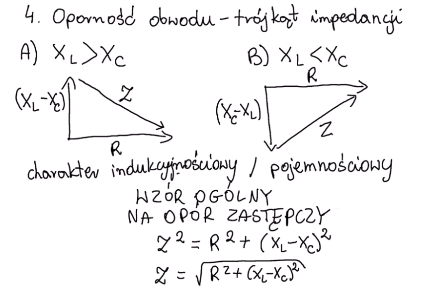
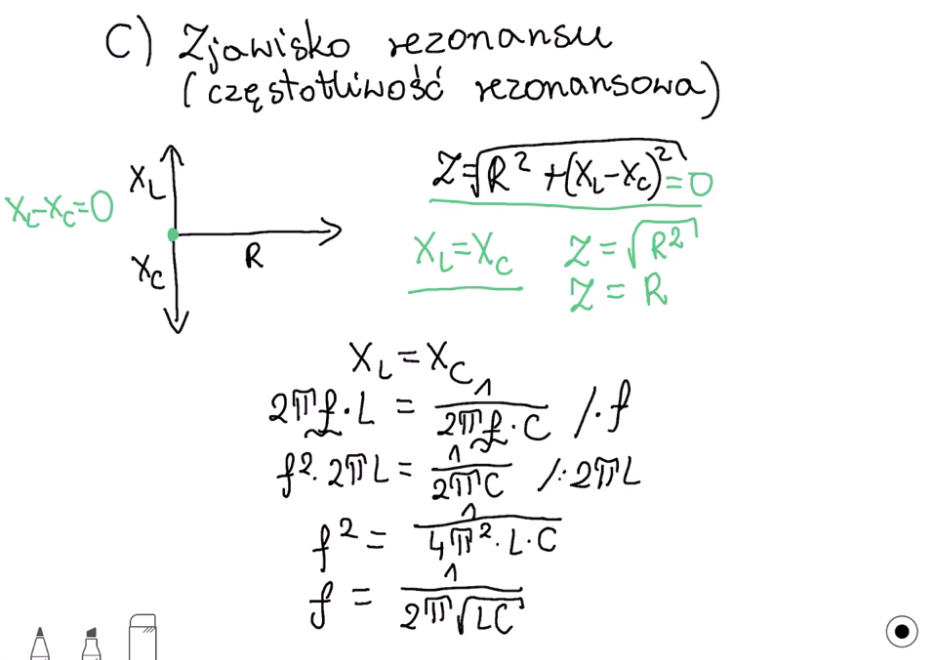

# Obwody RLC

https://www.youtube.com/watch?v=DfHwsbwgPcE&ab_channel=CoachMAX

1. **Prawo Ohma**

    Zakładając, że prąd płynie od lewej do prawej strony rezystora, stosujemy prawo Ohma. Dla prądu stałego proporcjonoalność napięcia $V$ i natężenia $I$ wyraża się wzorem:

    $$V_R = I \cdot R$$

2. **Pulsacja** 

    wielkość określająca, jak szybko powtarza się dane zjawisko okresowe; oznaczana małą literą omega (ω). Pulsacja jest powiązana z częstotliwością (f) i okresem (T) poprzez następującą zależność:
    $$ \omega ={\frac {d\theta }{dt}}={\frac {2\pi }{T}}=2\pi f$$

    gdzie: \
    $\omega$ – pulsacja (wyrażana w radianach na sekundę), \
    $\theta$ – faza ruchu drgającego (odpowiednik kąta w ruchu po okręgu), \
    $2\pi$ – kąt pełny ($2\pi$ radianów = 360 stopni). 

3. **Oporność cewki (reaktancja indukcyjnościowa)**

    $$X_{L}=\omega L$$
    gdzie: \
    $\omega$ – pulsacja prądu. \
    $L$ - to indukcyjność cewki, henr [H],

4. **Oporność kondensatora (reaktancja pojemnościowa)**

    $$X_{C}=-{\frac {1}{\omega C}}$$
    gdzie: \
    $\omega$ – pulsacja prądu. \
    $C$– pojemność kondensatora, Farad [F],

5. **Oporność obwodu (trójkąt impedancji)**

6. **Zjawisko rezonansu (częstotliwość rezonansowa)**

    f = czestotliwości graniczne 