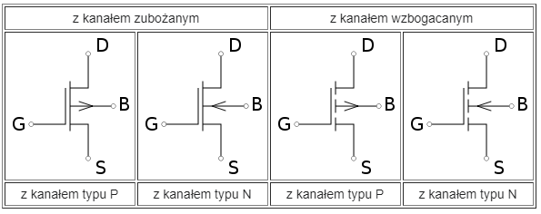

# Podstawy teoretyczne, klasyfikacja, metody analizy i syntezy układów cyfrowych. Typowe układy o różniej skali integracji. Przykłady zastosowań.

### Podstawy Teoretyczne:

**Układy cyfrowe**, także **układy logiczne**: 
- układy operujące na wartościach dyskretnych. 
  
- Układy cyfrowe budowane są w oparciu o bramki logiczne realizujące elementarne operacje logiczne: iloczyn logiczny (AND, NAND), sumę logiczną (OR, NOR), negację NOT, różnicę symetryczną (XOR). 
  
- Początkowo układy cyfrowe były realizowane jako układy mechaniczne, następnie elektromechaniczne, współcześnie tworzone są układy elektroniczne. Złożone układy cyfrowe wykonuje się w postaci układów scalonych.

  
---

### Klasyfikacja

1. **Ze względu na sposób przetwarzania informacji**:

   - **Układy kombinacyjne** – układy „bez pamięci”, w których sygnały wyjściowe są zawsze takie same dla określonych sygnałów wejściowych; multiplekser, demultiplekser, koder, dekoder
   
   - **Układy sekwencyjne** – układy „z pamięcią”, w których stan wyjść zależy nie tylko od aktualnego stanu wejść, ale również od stanów wcześniejszych. Układy asynchroniczne i synchroniczne (z zegarem)
   
2. **Ze względu na technologie tranzystorów**:

    **Bipolarne**:
    
    - **TTL (Transistor-Transistor Logic):**
      - szybkoś działania, ale wymaga więcej energii niż inne
      - stosunkowo niższy poziom szumów.
      - tanie 
      - przełączanie stanów logicznych związane jest z przechodzeniem tranzystorów ze stanu nasycenia do zatkania i odwrotnie.

    - **ECL (Emitter Coupled Logic):**
      - niskie opóźnienie propagacji
      - szybkość kosztem zużycia energii.

    - **I2L (Integrated Injection Logic):**
      - wprowadzenie nośników ładunku (iniekcji) do struktury tranzystorów.
      - dobrą wydajność przy niższym zużyciu energii. Szybkość TTL, zużycie energii na poziomie CMOS
      
    **Unipolarne (Tranzystory polowe, FET)**:
    - **NMOS i PMOS (N-type Metal-Oxide-Semiconductor i P-type Metal-Oxide-Semiconductor):**
      -  NMOS i PMOS to rodzaje technologii MOSFET (Metal-Oxide-Semiconductor Field-Effect Transistor), gdzie różnice polegają na typie domieszkowania (dodatnim dla PMOS i ujemnym dla NMOS).
      
      - NMOS używa aluminium (Al) a PMOS używa fosforu (P)
      
        

        - z kanałem zubożanym (z kanałem wbudowanym) – normalnie włączone
        - z kanałem wzbogacanym (z kanałem indukowanym) – normalnie wyłączone

    - **CMOS (Complementary MOS):**
      - CMOS łączy NMOS i PMOS, tworząc komplementarne pary. To połączenie pozwala na minimalne zużycie energii w stanie statycznym.
      - niskie zużycie energii 
      - dobrą skalowalność
   
3. **Programowalne układy cyfrowe** 

    W odróżnieniu od programowalnych mikroprocesorów, w tym przypadku programowana jest fizyczna struktura układu oparta na:

    **Matryce programowalne**:

    - **PLA (Programmable Logic Array):** składa się z dwóch głównych sekcji: AND-matrice (macierzy iloczynu logicznego) i OR-matrice (macierzy sumy logicznej). PLA umożliwia pełną dowolność w konfiguracji funkcji logicznych dzięki programowalnym multiplekserom i bramkom w obu sekcjach.

    - **PAL (Programmable Array Logic):** PAL składa się głównie z OR-matrice (macierzy sumy logicznej) i inwerterów, a wejścia AND są stałe. Programowanie odbywa się głównie poprzez konfigurację OR-matrycy i inwerterów. Znajduje zastosowanie tam, gdzie wymagana jest mniej skomplikowana logika, a prostota implementacji jest priorytetem.

    **Komórkowe układy programowalne**:

    - **SPLD (Simple Programmable Logic Device):** SPLD to prosty, programowalny układ logiczny, który może być używany do tworzenia prostych kombinacyjnych i sekwencyjnych funkcji logicznych. Często stosowany w aplikacjach, gdzie potrzebna jest mała ilość logiki programowalnej.

    - **CPLD (Complex Programmable Logic Device):** CPLD to bardziej zaawansowany programowalny układ logiczny niż SPLD. Składa się z wielu makrokomórek logicznych, które mogą być konfigurowane do realizacji złożonych funkcji. Wykorzystywany w bardziej złożonych układach cyfrowych, które wymagają większej ilości logiki programowalnej.

    - **FPGA (Field-Programmable Gate Array):** FPGA to najbardziej elastyczny rodzaj programowalnego układu cyfrowego. Składa się z wielu konfigurowalnych bloków logicznych oraz elementów interkonekcyjnych, co pozwala na tworzenie niemal dowolnej struktury logicznej. Stosowany w aplikacjach, gdzie wymagana jest duża elastyczność i możliwość rekonfiguracji układu.
  
# Metody analizy i syntezy układów cyfrowych

**Analiza układów cyfrowych:**

1. **Symulacje komputerowe:** Wykorzystywane są narzędzia do symulacji układów cyfrowych, które pozwalają na modelowanie zachowania układu podczas różnych scenariuszy działania. Symulacje umożliwiają przewidywanie wyników działania układu i identyfikowanie ewentualnych problemów przed implementacją fizyczną.

2. **Analiza czasowo-przestrzenna:** pozwala na optymalizację układu pod kątem **czasu propagacji** sygnałów i minimalizację zakłóceń. Określa się, jakie są **opóźnienia sygnałów** i jak rozkładają się ścieżki sygnałowe w przestrzeni. Analiza czasowo-przestrzenna 

3. **Analiza sygnałów i widm:** Pozwala na zrozumienie **charakterystyk sygnałów** w układzie, w tym analizę zakłóceń, szumów, czy potencjalnych sygnałów niepożądanych. Analiza widmowa pozwala na identyfikację składowych częstotliwościowych w sygnałach.

4. **Analiza zużycia energii:** Współczesne układy cyfrowe muszą być efektywne energetycznie. Analiza zużycia energii obejmuje określenie, ile energii zużywa układ podczas różnych operacji i w różnych trybach pracy.

**Metody syntezy układów cyfrowych:**

1. **Układy programowalne:** Umożliwia konfigurację układów za pomocą programowalnych układów logicznych (PLD) lub układów FPGA (Field-Programmable Gate Array). Programowanie tych układów pozwala na dostosowywanie ich funkcjonalności do konkretnych wymagań.

2. **Języki opisu sprzętu (HDL):** Synteza HDL (Hardware Description Language) umożliwia opisanie funkcjonalności układu w formie programu, który może zostać przetworzony na fizyczny układ. Popularnymi językami HDL są VHDL i Verilog.

3. **Automatyczne narzędzia projektowe:** Narzędzia CAD (Computer-Aided Design) pozwalają na automatyczne generowanie struktury układów cyfrowych na podstawie opisu funkcjonalnego. Te narzędzia potrafią optymalizować rozkład bramek logicznych, ścieżki sygnałowe i inne parametry układu.

# Typowe układy o różniej skali integracji i przykłady zastosowań

Skala integracji określa stopień skomplikowania i wielkość układów elektronicznych zawartych na jednym chipie (układzie scalonym). Istnieje kilka kategorii układów o różnej skali integracji:

1. **SSI (Small Scale Integration):**
   - Układy SSI zawierają zazwyczaj od kilku do kilkudziesięciu bramek logicznych.
   - Przykłady to bramki NAND, NOR, XOR, itp.
   - SSI jest wykorzystywane głównie w prostych układach cyfrowych.

2. **MSI (Medium Scale Integration):**
   - Układy MSI posiadają większą liczbę bramek logicznych niż SSI, zazwyczaj od kilkudziesięciu do kilkuset.
   - Przykłady to multipleksery, demultipleksery, rejestr przesuwny, itp.
   - MSI jest stosowane w bardziej złożonych układach cyfrowych.

3. **LSI (Large Scale Integration):**
   - Układy LSI charakteryzują się dużą liczbą bramek logicznych, liczoną w tysiącach.
   - Przykłady to mikroprocesory, mikrokontrolery, pamięci RAM, itp.
   - LSI umożliwiają projektowanie bardziej zaawansowanych systemów.

4. **VLSI (Very Large Scale Integration):**
   - Układy VLSI mają ogromną liczbę bramek logicznych, zazwyczaj w zakresie od kilku tysięcy do milionów.
   - Przykłady to zaawansowane mikroprocesory, układy FPGA (Field-Programmable Gate Array), czy układy ASIC (Application-Specific Integrated Circuit).
   - VLSI pozwala na implementację skomplikowanych funkcji na jednym chipie.

5. **ULSI (Ultra Large Scale Integration):**
   - Układy ULSI to jeszcze bardziej zaawansowana kategoria, gdzie liczba bramek logicznych sięga setek milionów lub nawet miliardów.
   - Przykłady to najnowsze mikroprocesory, GPU (Graphics Processing Unit), czy pamięci flash o wysokiej pojemności.

6. **GSI (Giga Scale Integration):**
   - Układy GSI to najnowsza kategoria, charakteryzująca się liczbą bramek logicznych przekraczającą miliard.
   - Przykłady to zaawansowane procesory używane w najnowszych technologiach.
