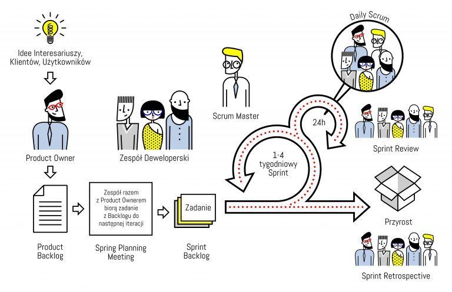

# Założenia metodologii SCRUM

  Diagram metodologii SCRUM <a href="https://agile247.pl/scrum/">[1]</a>

**SCRUM** to zwinna metodyka zarządzania projektem, często stosowana w obszarze rozwoju oprogramowania. Założenia metodologii SCRUM obejmują szereg kluczowych elementów, które pomagają w efektywnym i elastycznym prowadzeniu projektów. Oto główne założenia metodologii SCRUM:

### 1. **Iteracyjność i Inkrementacja:**

- Projekty są realizowane w krótkich cyklach czasowych zwanych sprintami, zwykle trwającymi od 1 do 4 tygodni. Na koniec każdego sprintu dostarczane jest nowe, działające oprogramowanie.

### 2. **Scrum Team:**

- Skład zespołu SCRUM obejmuje Product Ownera, Scrum Mastera i Development Team. Każdy członek zespołu ma określone role, a ich współpraca jest kluczowa dla sukcesu projektu.

### 3. **Product Backlog:**

- Product Owner zarządza Product Backlogiem, który jest listą wszystkich funkcji, zadań lub wymagań dotyczących projektu. Elementy Product Backlogu są priorytetowane zgodnie z wartością biznesową.

### 4. **Sprint Planning Meeting:**

- Na początku każdego sprintu odbywa się spotkanie planowania, podczas którego zespół wybiera zadania z Product Backlogu, które zamierza zrealizować w danym sprincie.

### 5. **Daily Scrum:**

- Codzienne spotkania zespołu, zwane Daily Scrum, pozwalają na synchronizację prac, identyfikację ewentualnych problemów oraz planowanie działań na najbliższy okres.

### 6. **Sprint Review:**

- Po zakończeniu sprintu odbywa się spotkanie zwane Sprint Review, podczas którego zespół prezentuje dostarczone funkcje, a interesariusze oceniają rezultaty.

### 7. **Retrospektywa Sprintu:**

- Spotkanie retrospektywne odbywa się po Sprint Review i służy do analizy przebiegu sprintu, zidentyfikowania mocnych stron i obszarów do poprawy.

### 8. **Przerwy między Sprintami:**

- Po zakończeniu jednego sprintu zaczyna się kolejny, a proces iteracyjny powtarza się. To pozwala na ciągłe dostarczanie wartości i adaptację do zmieniających się warunków.

### 9. **Dekompozycja Zadania:**

- Zadania są dekomponowane na mniejsze części, które są bardziej zrozumiałe i łatwiejsze do zrealizowania w jednym sprincie.

### 10. **Samozarządzanie i Organizacja:**

- Zespół jest odpowiedzialny za organizację i zarządzanie swoją pracą. Scrum Master wspiera proces, eliminując przeszkody, ale decyzje są podejmowane wspólnie.

### 11. **Inspekcja i Adaptacja:**

- SCRUM kładzie duży nacisk na inspekcję dostarczanych rezultatów i procesów, a następnie dostosowanie działań do uzyskanych informacji.

Metodologia SCRUM ma na celu zapewnienie elastyczności, szybkiego reagowania na zmiany oraz dostarczanie wartości biznesowej w krótkich okresach czasu. Jest stosunkowo prostą, a jednocześnie skuteczną strukturą, umożliwiającą efektywne zarządzanie projektami.
