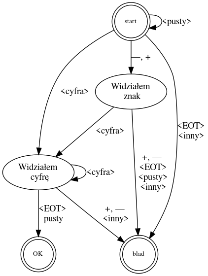

# Automaty skończone 

Metoda automatów skończonych to jedna z technik stosowanych w analizie leksykalnej do rozpoznawania i generowania leksemów (tokenów) na podstawie sekwencji znaków w źródłowym kodzie. Automaty skończone są abstrakcyjnym modelem matematycznym opisującym maszyny, które mogą znajdować się w pewnych stanach, a ich zachowanie jest kontrolowane przez przejścia między tymi stanami w odpowiedzi na wejściowe symbole.

 
  

  <b>Przykładowy automat skończony</b><a href="https://kmim.wm.pwr.edu.pl/myszka/dydaktyka/informatyka-i/zaraza/automaty-skonczone/">[1]</a>

Oto ogólny opis metody automatów skończonych w kontekście analizy leksykalnej:

1. **Definicja Automatu Skończonego:**
   - **Stany:** Automat skończony ma zdefiniowany zestaw stanów, które reprezentują różne fazy procesu analizy leksykalnej.
   - **Przejścia:** Istnieją przejścia między stanami w odpowiedzi na odczytane symbole wejściowe (znaki z kodu źródłowego).

2. **Definicja Leksemu:**
   - **Leksemy:** Każdy stan automatu jest związany z pewnym leksemem (tokenem), który reprezentuje daną jednostkę leksykalną, na przykład identyfikator, liczba czy operator.

3. **Implementacja Automatu:**
   - **Tabela Przejść:** Automat skończony jest zazwyczaj implementowany za pomocą tabeli przejść. Tabela ta określa, jakie przejścia są dozwolone dla danego stanu i symbolu wejściowego.

4. **Rozpoznawanie Leksemów:**
   - **Analiza Stanów:** Przetwarzanie każdego znaku z kodu źródłowego powoduje zmianę stanu automatu zgodnie z tabelą przejść.
   - **Rozpoznawanie Leksemów:** Po osiągnięciu stanu akceptującego, rozpoznaje się leksem związany z danym stanem.

5. **Implementacja Praktyczna:**
   - **Implementacja w Kodzie:** Automat skończony jest zazwyczaj implementowany w kodzie źródłowym, a lekser jest odpowiedzialny za przetwarzanie strumienia znaków i wykrywanie leksemów przy użyciu automatu skończonego.

### Przykład:
Rozważmy prosty automat skończony do rozpoznawania liczb całkowitych w języku programowania:

- **Stany:** {START, INTEGER, ERROR}
- **Przejścia:**
  - `START` -> (`DIGIT` -> `INTEGER`) / (`OTHER` -> `ERROR`)
  - `INTEGER` -> (`DIGIT` -> `INTEGER`) / (`OTHER` -> `ERROR`)

W tym przypadku, automatem zaczyna w stanie `START`, przechodzi do stanu `INTEGER` po odczytaniu cyfry (`DIGIT`), i zwraca błąd (`ERROR`) w przypadku odczytania innego znaku (`OTHER`).

Automat skończony dla analizy leksykalnej umożliwia skuteczne i efektywne rozpoznawanie leksemów w źródłowym kodzie programu. Jest to jedna z kluczowych technik stosowanych w procesie kompilacji.