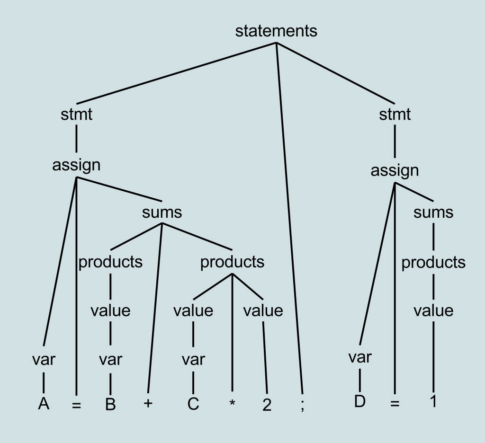

# Metoda wstępująca

Metoda wstępująca (ang. Bottom-Up Parsing) to technika analizy składniowej, która zaczyna od analizy najbardziej elementarnych składników zdania, a następnie skupia się na budowie struktury zdania w górę, aż do osiągnięcia nieterminala początkowego.

### Główne Koncepcje Metody Wstępującej:

1. **Redukcja:**

   - Metoda wstępująca zaczyna od terminali (najbardziej podstawowych jednostek, np. liczby, identyfikatory) i stara się redukować je do nieterminali (większych jednostek, np. wyrażenia, zdania) przy użyciu reguł gramatyki.

2. **Utworzenie Drzewa Składniowego od Dna:**

   - Proces zaczyna się od samego dołu, od terminali, a następnie buduje drzewo składniowe zdania w górę, łącząc te terminale według reguł gramatyki, aż do osiągnięcia nieterminala początkowego.

3. **Shift i Reduce:**

   - W trakcie analizy, kiedy odpowiednie terminale są znalezione, następuje operacja "Shift" (przesunięcie) lub "Reduce" (redukcja), gdzie terminale są łączone, tworząc bardziej złożone struktury.

4. **Automat z Wykorzystaniem Stosu:**
   - Metoda wstępująca często korzysta z automatu ze stosem do śledzenia bieżącego stanu analizy. W trakcie analizy, gdy pewne kombinacje terminali występują, następuje redukcja, co prowadzi do przeniesienia się na wyższy poziom abstrakcji w drzewie składniowym.

### Przykład:

  A = B + C * 2 ; D = 1

 
  

&nbsp;

 
  

  <b>Bottom-Up Parsing</b><a href="https://en.wikipedia.org/wiki/Bottom-up_parsing">[1]</a>

Metoda wstępująca jest często używana w parserach generowanych automatycznie na podstawie gramatyki. Jest skuteczna dla szerszego zakresu gramatyk niż metoda zstępująca, ale wymaga większej ilości zasobów komputerowych do analizy.