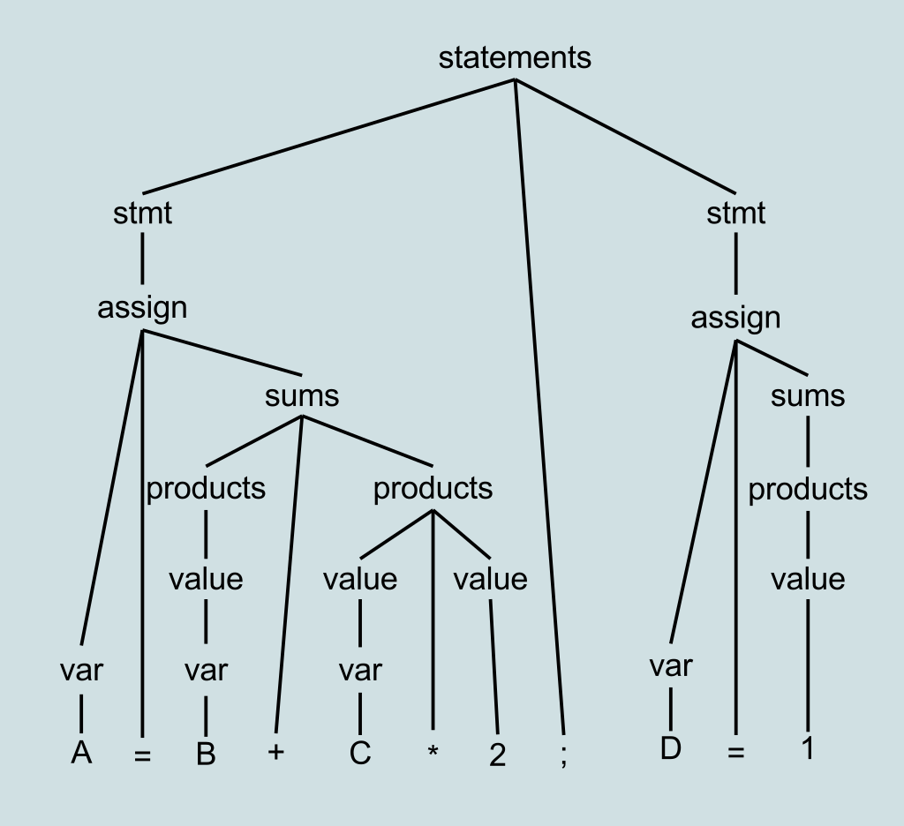
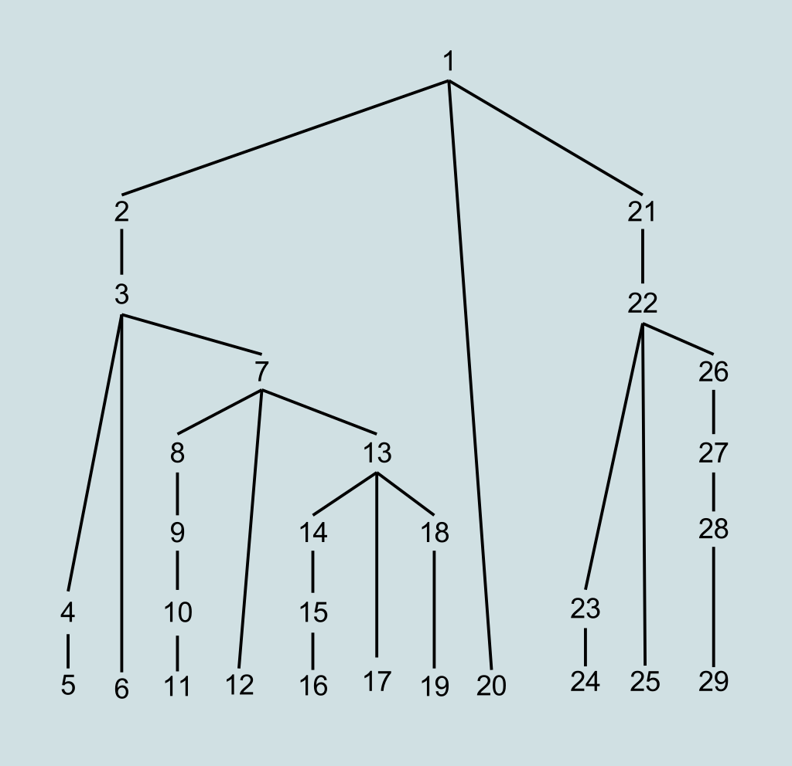

# Metoda zstępująca

Metoda zstępująca (ang. Top-Down Parsing) to technika analizy składniowej (parsing), która zaczyna od najwyższego nieterminala w gramatyce i stara się przekształcić go w strumień terminali, stosując reguły produkcji gramatyki. Jest to jedna z dwóch głównych strategii analizy składniowej, drugą jest metoda wstępująca (Bottom-Up Parsing).

### Kroki Metody Zstępującej:

1. **Rozpoczęcie od Nieterminala Początkowego:**
   - Analiza zaczyna się od nieterminala początkowego gramatyki. Nieterminal ten reprezentuje całą strukturę gramatyczną, którą chcemy przeanalizować.

2. **Próba Dopasowania do Produkcji:**
   - Metoda zstępująca stara się dopasować strumień terminali do produkcji nieterminala początkowego, korzystając z reguł gramatycznych.

3. **Rekurencyjne Rozkładanie na Podproblemy:**
   - Gdy analiza napotyka na nieterminal w produkcji, proces rekurencyjnie podąża za regułami produkcji tego nieterminala, próbując dopasować kolejne elementy.

4. **Zawracanie w Przypadku Błędu lub Ukończenia:**
   - W przypadku, gdy analiza osiągnie koniec strumienia terminali i poprawnie dopasuje wszystkie elementy, proces kończy się sukcesem. W przypadku błędu, analiza zawraca do punktu poprzedzającego błąd.

### Przykład:

  A = B + C * 2 ; D = 1

 
  

&nbsp;

 
  

  <b>Top-down Parsing</b><a href="https://en.wikipedia.org/wiki/Top-down_parsing">[1]</a>

Metoda zstępująca jest stosowana w parserach rekurencyjnych zstępujących, które mogą być łatwo zdefiniowane za pomocą gramatyki w formie BNF (Backus-Naur Form). Jej zrozumienie i implementacja są kluczowe dla procesu analizy składniowej w kompilatorach.