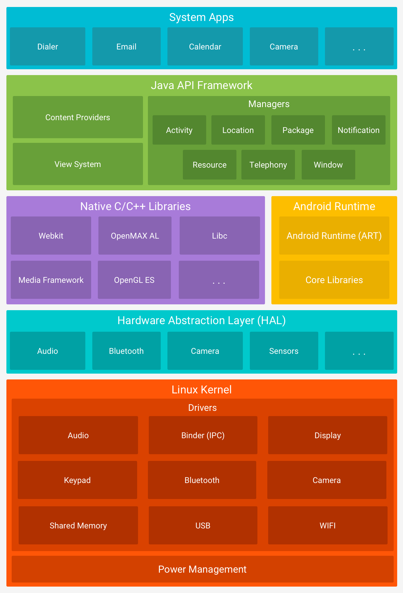

# Architektura systemu Android od strony programistycznej

<p align="center">

</p>

### Jądro Linuksa
Jądro Linuksa w architekturze systemu Android stanowi podstawową warstwę systemową, zapewniającą funkcje zarządzania zasobami i interakcji z sprzętem. Jądro to obsługuje podstawowe operacje systemowe, takie jak zarządzanie pamięcią, planowanie procesów, obsługa sterowników urządzeń, a także implementuje funkcje bezpieczeństwa. Android, jako system operacyjny oparty na jądrze Linuksa, korzysta z jego funkcji do obsługi wielozadaniowości, zarządzania energią i komunikacji między warstwą aplikacji a sprzętem urządzenia mobilnego.

### Warstwa abstrakcji sprzętu (HAL)
Warstwa abstrakcji sprzętu (HAL) zapewnia standardowe interfejsy, które udostępniają możliwości sprzętowe urządzenia platformie Java API wyższego poziomu. HAL składa się z wielu modułów bibliotecznych, z których każdy implementuje interfejs dla określonego typu komponentu sprzętowego, takiego jak kamera lub moduł Bluetooth. Kiedy framework API wywołuje żądanie dostępu do sprzętu urządzenia, system Android ładuje moduł biblioteczny dla tego komponentu sprzętowego.

### Środowisko wykonawcze Androida
W przypadku urządzeń z systemem Android w wersji 5.0 (poziom interfejsu API 21) lub nowszym każda aplikacja działa w ramach **własnego procesu i własnej instancji środowiska** wykonawczego systemu Android (ART). ART został napisany w celu uruchamiania wielu maszyn wirtualnych na urządzeniach o małej ilości pamięci poprzez wykonywanie plików w formacie Dalvik Executable (DEX), formacie kodu bajtowego zaprojektowanym specjalnie dla systemu Android i zoptymalizowanym pod kątem minimalnego zużycia pamięci. Narzędzia do tworzenia, takie jak **d8**, kompilują źródła Java do kodu bajtowego DEX, który można uruchomić na platformie Android. 

```
Java -> d8 -> .dex -> Android
```

Niektóre z głównych cech ART obejmują:

- Głównie kompilacja z wyprzedzeniem (AOT) i dokładnie na czas (JIT).

- Zoptymalizowane zbieranie śmieci (GC)

- Lepsza obsługa debugowania, w tym dedykowany profiler próbkowania, szczegółowe wyjątki diagnostyczne i raportowanie o awariach oraz możliwość ustawiania punktów kontrolnych w celu monitorowania określonych pól

Przed wersją Androida 5.0 (poziom API 21) Dalvik był środowiskiem wykonawczym Androida. Jeśli Twoja aplikacja działa dobrze na ART, może działać również na Dalvik, ale sytuacja odwrotna może nie być prawdą.


### Natywne biblioteki C/C++
Wiele podstawowych komponentów i usług systemu Android, takich jak ART i HAL, jest zbudowanych z kodu natywnego, który wymaga natywnych bibliotek napisanych w językach C i C++. Platforma Android udostępnia interfejsy API platformy Java umożliwiające udostępnianie aplikacjom funkcjonalności niektórych z tych natywnych bibliotek. Na przykład możesz uzyskać dostęp do OpenGL ES poprzez interfejs Java OpenGL API platformy Android, aby dodać obsługę rysowania i manipulowania grafiką 2D i 3D w swojej aplikacji.


### Struktura API Java
Cały zestaw funkcji systemu operacyjnego Android jest dostępny za pośrednictwem interfejsów API napisanych w języku Java. Te interfejsy API stanowią elementy potrzebne do tworzenia aplikacji na Androida, upraszczając ponowne wykorzystanie podstawowych, modułowych komponentów systemu i usług, które obejmują:

- Bogaty i rozszerzalny system widoków, którego można używać do tworzenia interfejsu użytkownika aplikacji, obejmującego listy, siatki, pola tekstowe, przyciski, a nawet wbudowaną przeglądarkę internetową

- Dostawcy treści, którzy umożliwiają aplikacjom dostęp do danych z innych aplikacji, takich jak aplikacja Kontakty, lub udostępnianie własnych danych

- Menedżer zasobów zapewniający dostęp do zasobów innych niż kod, takich jak zlokalizowane ciągi znaków, grafika i pliki układu

- Menedżer powiadomień, który umożliwia wszystkim aplikacjom wyświetlanie niestandardowych alertów na pasku stanu

- Menedżer aktywności, który zarządza cyklem życia aplikacji i zapewnia wspólny stos nawigacji

Programiści mają pełny dostęp do tych samych interfejsów API platformy, z których korzystają aplikacje systemu Android.

### Aplikacje systemowe
Android zawiera zestaw podstawowych aplikacji do obsługi poczty e-mail, wiadomości SMS, kalendarzy, przeglądania Internetu, kontaktów i nie tylko. Aplikacje zawarte na platformie nie mają specjalnego statusu wśród aplikacji, które użytkownik zdecyduje się zainstalować. Zatem aplikacja innej firmy może stać się domyślną przeglądarką internetową użytkownika, komunikatorem SMS, a nawet domyślną klawiaturą. Obowiązują pewne wyjątki, takie jak systemowa aplikacja Ustawienia.

Aplikacje systemowe działają zarówno jako aplikacje dla użytkowników, jak i zapewniają kluczowe funkcje, do których programiści mogą uzyskać dostęp z poziomu własnych aplikacji. Na przykład, jeśli chcesz, aby Twoja aplikacja dostarczała wiadomości SMS, nie musisz samodzielnie tworzyć tej funkcji. Zamiast tego możesz wywołać dowolną aplikację SMS, która jest już zainstalowana, aby dostarczyć wiadomość do określonego odbiorcy.
