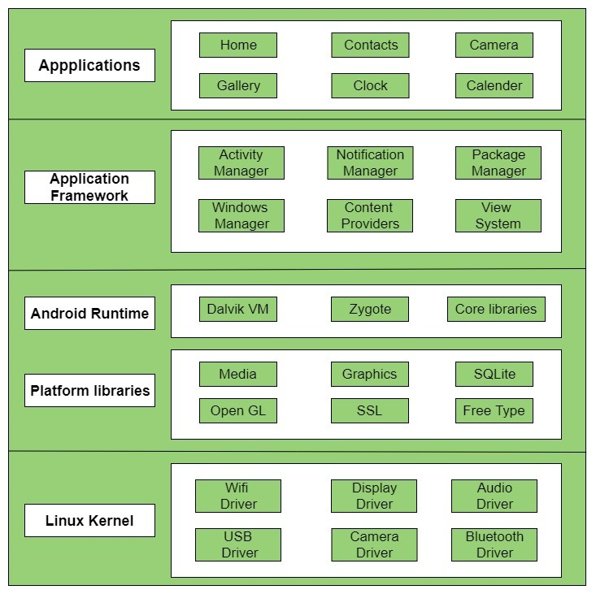

# Architektura systemu Android od strony programistycznej

 
  

  <b>Architektura systemu Android</b><a href="https://www.geeksforgeeks.org/android-architecture/">[1]</a>

Architektura systemu Android została zaprojektowana z uwzględnieniem różnych komponentów, aby sprostać różnorodnym potrzebom urządzeń z systemem Android. System opiera się na jądrze Linuxa, które zawiera zbiór bibliotek C/C++, udostępnionych poprzez framework aplikacyjny. Kluczowe komponenty architektury Androida obejmują:

### 1. Aplikacje:
   - Najwyższa warstwa architektury Androida, gdzie instalowane są aplikacje preinstalowane i te pobrane z Google Play.
   - Działa w ramach środowiska wykonawczego Androida, korzystając z klas i usług dostarczanych przez framework aplikacyjny.

### 2. Framework Aplikacyjny:
   - Dostarcza istotne klasy do tworzenia aplikacji Androida i oferuje ogólną abstrakcję dla dostępu do sprzętu.
   - Zarządza interfejsem użytkownika i zasobami aplikacji.
   - Zawiera usługi takie jak menedżer aktywności, menedżer powiadomień, menedżer pakietów, niezbędne do rozwoju aplikacji.

### 3. Android Runtime:
   - Składa się z podstawowych bibliotek i maszyny wirtualnej Dalvik (DVM).
   - Stanowi podstawę dla frameworka aplikacyjnego, umożliwiając działanie aplikacji dzięki bibliotekom podstawowym.
   - DVM, maszyna wirtualna oparta na rejestrach, zoptymalizowana pod kątem Androida, zapewnia efektywne wykonanie wielu instancji.
   - Zależy od jądra Linuxa w kwestii obsługi wątków i zarządzania pamięcią na niskim poziomie.
   - Pozwala na implementację aplikacji Androida w standardowych językach programowania, takich jak Java lub Kotlin.

### 4. Biblioteki Platformowe:
   - Obejmuje biblioteki rdzeniowe napisane w C/C++ oraz biblioteki oparte na języku Java (Media, Grafika, Menedżer powierzchni, OpenGL itp.), wspierające rozwój aplikacji Androida.
   - Zapewniają obsługę odtwarzania multimediów, renderowania grafiki, zarządzania podsystemem wyświetlania, grafiki 2D i 3D, operacji na bazie danych, renderowania czcionek, wyświetlania treści internetowych i zabezpieczeń za pomocą SSL.

### 5. Jądro Linuxa:
   - Jest sercem architektury Androida, zarządzając sterownikami urządzeń (wyświetlacz, kamera, Bluetooth, dźwięk, pamięć itp.) podczas działania systemu.
   - Pełni rolę warstwy abstrakcji między sprzętem a pozostałymi komponentami architektury.
   - Odpowiada za zarządzanie pamięcią, zarządzanie zasilaniem, zarządzanie urządzeniem i zapewnienie bezpieczeństwa.
   - Zapewnia funkcje zabezpieczeń systemu, efektywne zarządzanie pamięcią, zarządzanie procesami, obsługę komunikacji sieciowej oraz integrację ze sterownikami od producentów sprzętu.

Podsumowując, architektura Androida to warstwowa struktura, która wykorzystuje jądro Linuxa, środowisko wykonawcze, framework aplikacyjny i biblioteki platformowe, aby dostarczyć solidną i elastyczną platformę do tworzenia i uruchamiania aplikacji Androida na różnych urządzeniach.