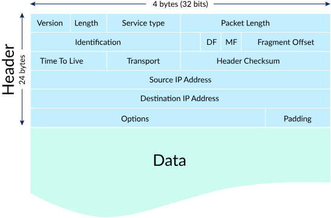
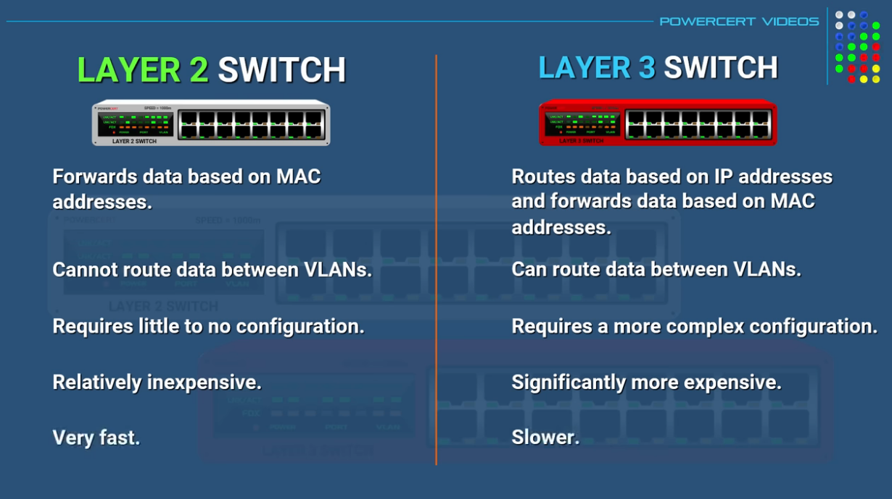

# Omów urządzenia występujące w sieciach komputerowych zgodnie z modelem ISO/OSI

Hub, Switch and Router: <a src="https://www.youtube.com/watch?v=1z0ULvg_pW8&ab_channel=PowerCertAnimatedVideos">Link</a>\
Modem vs Router: <a src="https://www.youtube.com/watch?v=Mad4kQ5835Y&ab_channel=PowerCertAnimatedVideos">Link</a>\
Layer 2 vs Layer 3 Switches: <a src="https://www.youtube.com/watch?v=bdNS0K4Bt8U&ab_channel=PowerCertAnimatedVideos">Link</a>\
Default Gateway: <a src="https://www.youtube.com/watch?v=pCcJFdYNamc&ab_channel=PowerCertAnimatedVideos">Link</a>

Model OSI (Open Systems Interconnection) jest modelem warstwowym, który pomaga zrozumieć i opisać, jak różne elementy sieci komunikują się ze sobą. Składa się z siedmiu warstw, z których każda odpowiada za konkretne zadania. Oto omówienie urządzeń występujących w sieciach komputerowych zgodnie z modelem OSI:

1.  **Warstwa Fizyczna (Warstwa 1):**

    **Charakterystyka:** Odpowiada za przesyłanie bitów między urządzeniami. Zajmuje się sprzętowymi aspektami transmisji danych, takimi jak kable, sygnały elektryczne i świetlne.

    **Przykładowe Urządzenia:**

    1. **Medium transmisyjne:** To fizyczne środowisko, przez które odbywa się przesyłanie danych. Może to obejmować różne rodzaje kabli (np. miedziane, światłowodowe), fale radiowe lub inny rodzaj medium.

    2. **Kable i Złącza:** Kable elektryczne, światłowodowe, skrętka miedziana, złącza i gniazda służące do połączenia urządzeń.

    3. **Repeater (Wzmacniacz):** Urządzenie wzmacniające sygnał, które jest używane w celu zrekompensowania utraty sygnału w trakcie przesyłania przez długie trasy kablowe.

    4. **Hub (Koncentrator):** Urządzenie, które umożliwia łączenie wielu urządzeń w jednym segmencie sieci. Hub działa na warstwie fizycznej i powiela sygnał do wszystkich portów.

    5. **Modem:** Urządzenie służące do modulacji i demodulacji sygnałów, co pozwala na przesyłanie danych między sieciami analogowymi (np. telefonicznymi) a cyfrowymi.

    6. **Transceivery:** Komponenty, które służą do przesyłania i odbierania sygnałów. Mogą być zintegrowane w interfejsach sieciowych, takich jak karty sieciowe.

    7. **Konwertery:** Urządzenia służące do konwersji sygnałów, na przykład z cyfrowego na analogowy (DAC) lub z analogowego na cyfrowy (ADC).

    8. **Medium transmisyjne bezprzewodowe:** W przypadku sieci bezprzewodowych, warstwa fizyczna obejmuje także anteny, fale radiowe i inne elementy związane z transmisją bezprzewodową.

2.  **Warstwa Łącza Danych (Warstwa 2):**

    **Charakterystyka:** Zapewnia niezawodny przesył danych między sąsiednimi węzłami w sieci. Odpowiada za adresację fizyczną i zarządzanie dostępem do medium transmisyjnego.

    **Przykładowe Urządzenia:**

    1. **Karta Sieciowa (Network Interface Card - NIC):** To fizyczne urządzenie, zwykle zintegrowane z komputerem lub dodawane jako karta rozszerzeń, które umożliwia komunikację komputera z siecią. Służy do przekształcania pakietów danych w sygnały. Posiada własny, unikatowy w skali światowej adres fizyczny, znany jako adres MAC, przyporządkowany w momencie jej produkcji przez producenta np. 00:0A:E6:3E:FD:E1 jest 6 bajtów, 48 bitów zapisanych szesnastkowo.

    2. **Przełącznik (Switch):** obsługuje wiele portów i jednocześnie przetwarza ruch między nimi. Wykorzystuje adresy MAC do przesyłania ramek (pakietów) do odpowiednich portów.
    
        Przełącznik określa się też jako wieloportowy most lub inteligentny koncentrator, gdyż:

        - przekazuje ramki wyłącznie do docelowego segmentu sieci (podobnie do mostu, w przeciwieństwie do koncentratora)
        - umożliwia połączenie wielu segmentów sieci w gwiazdę (podobnie do koncentratora, w przeciwieństwie do mostu ograniczonego do dwóch segmentów)
        - działa w trybie dupleks.

  

  

1.  **Warstwa Sieci (Warstwa 3):**

    **Charakterystyka:** Odpowiada za routing i przekazywanie pakietów między różnymi sieciami. Zarządza adresacją logiczną i decyduje o najlepszej ścieżce dla pakietu.

    **Przykładowe Urządzenia:**

    1. **Layer 3 Switch:** Kombinuje funkcje routera i switcha, umożliwiając przekazywanie pakietów na podstawie adresów IP. Można dzięki nim zastąpić architekturę router on the stick. Brak interfejsu WAN. Umożliwia wymianę danych między VLAN-ami

    2. **Router**: Odpowiada za przekazywanie pakietów między różnymi sieciami na podstawie adresów IP. Router podejmuje decyzje dotyczące najlepszej ścieżki dla przesyłania pakietów.

    3. **Bramka (Gateway)**: Bramka to urządzenie, które tłumaczy protokoły komunikacyjne między różnymi sieciami. Działa na poziomie Warstwy Sieci i Warstwy Aplikacji. Bramki są używane, gdy dwie sieci komunikują się za pomocą różnych protokołów.
   
Pozostałe warstwy:
---

4.  **Warstwa Transportowa (Warstwa 4):** Zapewnia niezawodną komunikację między aplikacjami na różnych urządzeniach. Odpowiada za segmentację, kolejkowanie i przesyłanie pakietów.
**Brama (Gateway) na Poziomie Transportu:** Może pełnić funkcje konwersji między różnymi protokołami transportowymi, np. TCP a UDP.

5.  **Warstwa Sesji (Warstwa 5):** Zarządza sesjami komunikacyjnymi między aplikacjami na różnych urządzeniach. Kontroluje rozpoczynanie, utrzymywanie i zakończenie sesji.
**Serwery Sesji:** Mogą zarządzać i kontrolować sesje między aplikacjami.

6.  **Warstwa Prezentacji (Warstwa 6):** Odpowiada za konwersję, kodowanie i kompresję danych, aby aplikacje na różnych urządzeniach mogły współpracować.

7.  **Warstwa Aplikacji (Warstwa 7):** Zapewnia interfejs między aplikacjami a siecią. Odpowiada za komunikację między różnymi aplikacjami, obsługuje protokoły komunikacyjne. Zapewniają usługi i zasoby aplikacyjne dla użytkowników lub innych aplikacji.
