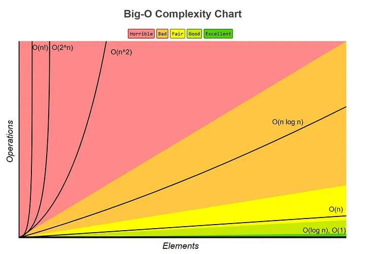

# Objaśnij znaczenie zapisu O(n) oraz scharakteryzuj wpływ doboru struktury danych na czas wykonania programu.

Zapis O(n) -  miara określająca zachowanie wartości funkcji wraz ze wzrostem jej argumentów. odnosi się do notacji wielomianowej (czasowej lub przestrzennej) używanej w analizie algorytmów. Oznacza to górną granicę złożoności czasowej lub przestrzennej algorytmu w zależności od rozmiaru danych wejściowych. 

 
  

  <b>Wykres złożoności czasowej</b><a href="[link do źródła](https://towardsdatascience.com/understanding-time-complexity-with-python-examples-2bda6e8158a7)">[1]</a>

Przykłady złożoności czasowej:

- $O(1)$, Stała złożoność czasowa 
  - Dostęp do indeksu tablicy (int a = ARR[5])
  - Wstawianie węzła w liście 
  - Push i Pop elementów na stosie
  - Wstawianie i usuwanie z kolejki
  - Przeskok do następnego/poprzedniego elementu na liście podwójnie połączonej

- $O(log \ n)$, Logarytmiczna złożoność czasowa.
  - Binary Search
  - Znajdowanie największej/najmniejszej liczby w BST
  - Niektóre algorytmy „Dziel i rządź” 

- $O(n)$, Liniowa złożoność czasowa.
  - Przechodzenie przez tablicę
  - Przechodzenie przez listę połączoną
  - Usunięcie określonego elementu z połączonej listy (nieposortowanej)
  - Porównywanie dwóch ciągów znaków
  - Sprawdzam Palindrom
  
- $O(n\ log \ n)$, Iloczyn rozmiaru danych i logarytmu tego rozmiaru.
  - Merge Sort
  - Heap Sort
  - Quick Sort

- $O(n^2)$, Kwadratowa złożoność czasowa.
  - Bubble Sort
  - Insertion Sort
  - Selection Sort
  - Przechodzenie 2D array

- $O(2^n)$, Wykładnicza złożoność czasowa.

### Wpływ Doboru Struktury Danych na Czas Wykonania Programu:

Dobór odpowiedniej struktury danych ma znaczący wpływ na czas wykonania programu. Oto kilka kwestii, które warto rozważyć:

1. **Wyszukiwanie i Wstawianie:**
   - Struktury danych, takie jak drzewa binarne, mogą umożliwić efektywne operacje wyszukiwania i wstawiania. Wyszukiwanie w drzewie binarnym ma złożoność $\log n$, co jest znacznie lepsze niż liniowe przeszukiwanie listy $O(n)$.

2. **Operacje na Końcu Struktury:**
   - Listy są efektywne do szybkich operacji na końcu struktury (np. dodawanie elementów na końcu). Operacje na końcu tablicy mogą wymagać przesunięcia wszystkich elementów, co jest bardziej kosztowne.

3. **Złożoność Wyszukiwania:**
   - Wybór struktury danych zależy od rodzaju operacji, jakie będą wykonywane. Jeśli głównie zachodzi potrzeba wyszukiwania, to drzewo binarne lub tablica haszująca mogą być bardziej odpowiednie.

4. **Złożoność Pamięciowa:**
   - Wpływ na czas wykonania programu nie obejmuje tylko samego czasu wykonania, ale również złożoność pamięciową. Niektóre struktury danych są bardziej efektywne pod względem pamięci niż inne.

5. **Dynamiczne vs. Statyczne:**
   - Dynamiczne struktury danych, takie jak listy lub drzewa, mogą dostosowywać się do zmian rozmiaru, co jest korzystne w przypadku dynamicznie zmieniających się danych. Struktury statyczne, takie jak tablice, są ograniczone stałym rozmiarem.

6. **Rodzaj Operacji:**
   - Różne struktury danych są zoptymalizowane pod kątem różnych rodzajów operacji. Należy zastanowić się, czy program będzie bardziej intensywny pod względem operacji odczytu czy zapisu, a następnie dostosować strukturę danych odpowiednio.

Dobór odpowiedniej struktury danych jest kluczowy dla efektywności programu, a świadome podejście do tego zagadnienia może znacznie poprawić wydajność i skalowalność systemu.