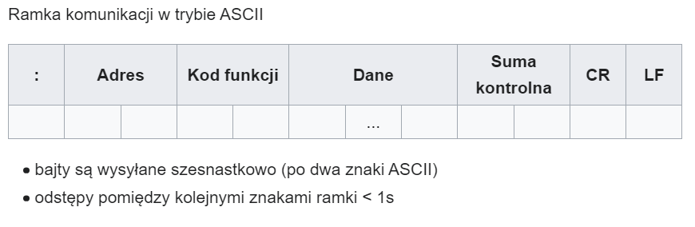
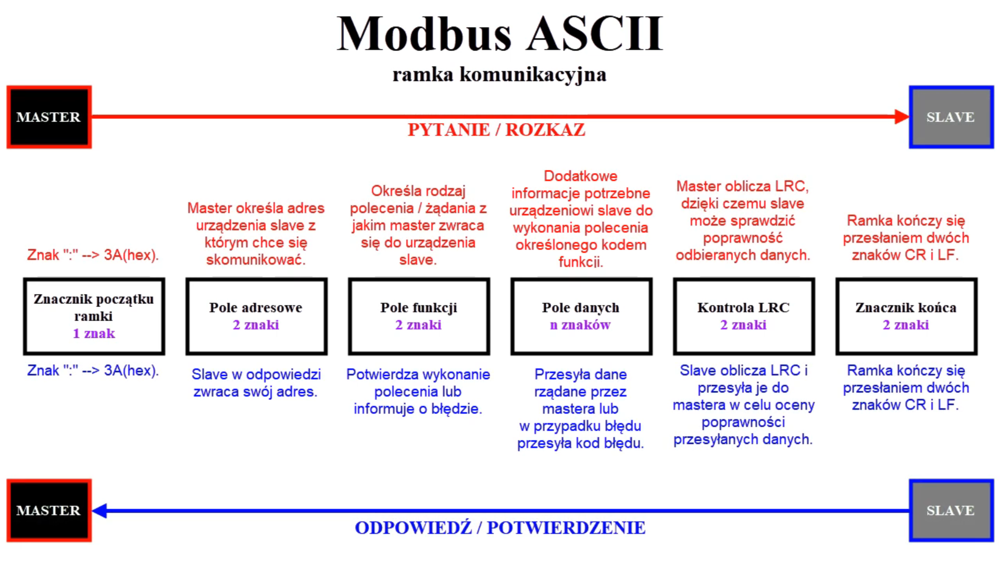
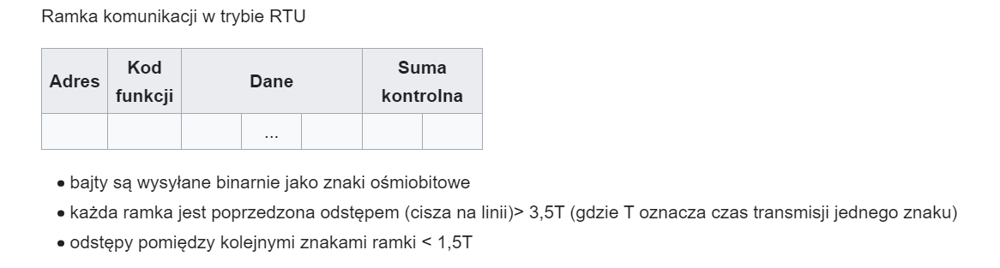
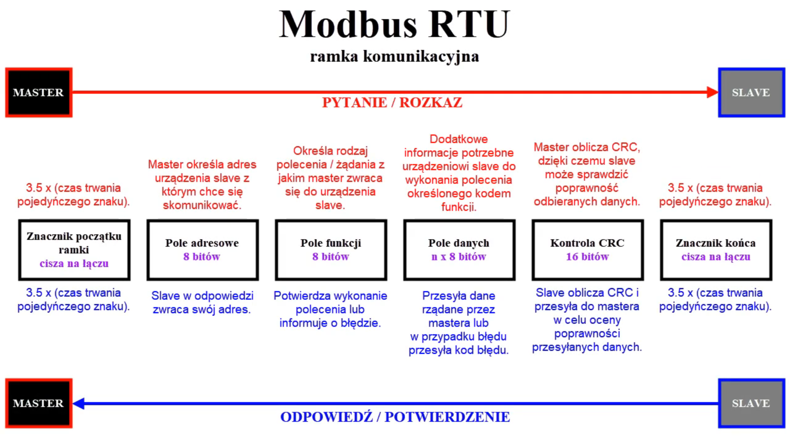
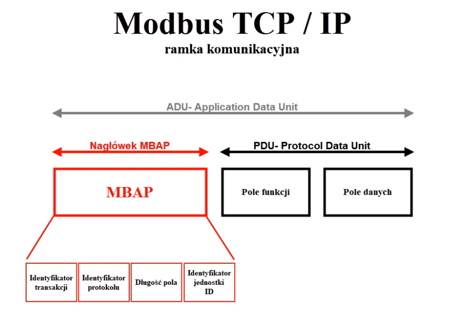
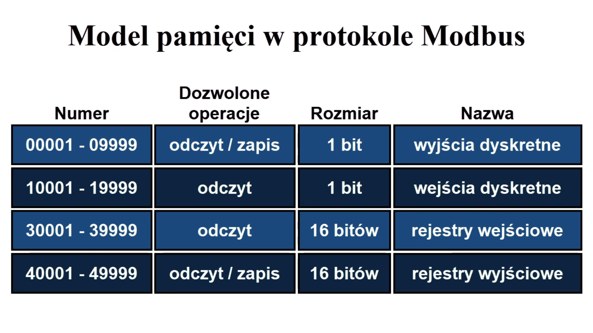

# Modbus

https://www.youtube.com/watch?v=GfpETOvXvi4

Modbus – stworzony w 1979r. przez firmę **Modicon** przejęta później przez **Schneider Electric**. Modbus jest obecnie standardem otwartym, co przyczyniło się do jego dużego rozpowszechnienia. Służy do komunikacji z programowalnymi kontrolerami. Umożliwia zarządzanie siecią takich urządzeń jak np. system sterowania temperatury i wilgotności. W sieciach IP używany jest protokół TCP na porcie 502. Modbus jest protokołem typu **Client-Server**. Początkowo działał poprzez port szeregowy RS-232 lecz wraz z rozwojem protokołu możliwe było wykorzystanie RS-485, co pozwalało na zwiększenie prędkości transmisji.

**Typy transmisji danych w sieci Modbus:**

- ASCII (znakowy)
- RTU (binarny)
- TCP/IP
- Modbus Plus

Wykorzystują standardy:
- RS-485
- RS-422
- RS-232
  
Wymiana informacji między urządzeniami odbywa się w konfiguracji **Master-Slave**. Tylko urządzenie nadrzędne może inicjować wymiane informacji a slave odpowiada. 

Jeżeli chcemy połączyć ze sobą np. 2 urządzenia na niewielkiej odległości (do 15m) to można wykorzystać standard RS-232. Jeżeli chcemy uzyskać komunikację na większej odległości lub na jednej lini pracjuą więcej niż 2 urządzenia to należy wybrać standard RS-485 lub RS-422 ponieważ charakteryzują się większą odpornością na zakłócenia 

Wymiana informacji pomiędzy urządzeniami, nazywana też transakcją, skłąda się z polecenia oraz odpowiedzi. W odpowiedzi mogą być zawarte żądane dane lub potwierdzenie wykonania polecenia. 

Każde urządzenie ma swój adres ale można też wysyłać polecenia typu broadcast, wtedy urządzenia podrzędne nie wysyłają odpowiedzi

Informacje wysyłane od mastera do slave'a mają określony format w postaci ramki komunikacyjnej

W Sieci modbus mogą być do 247 slave-ów (adresy od 1-247), adres #0 dla wiadomości rozgłoszeniowych

W standardzie RS-485 możliwe jest podłączenie do 32 urządzeń w 1 segmencie sieci powyżej tej liczby należy wykorzystać wzmacniacze łączące poszczególne segmenty sieci

Prędkość wymiany informacji to 9600-19200 bps

## Modbus ASCII

## Modbus RTU

## Modbus TCP/IP
TCP/IP jest komunikacją client-server. Urządzenia wykorzystują przewód internetowy oraz switche. Mastery mogą wysyłać polecenia nie czekając na odpowiedź. Port 502

## Model pamięci 
