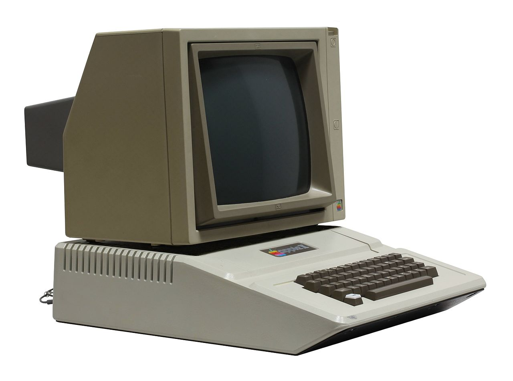

# Witamy w La Défense!

<p align="center"></p>

> "Obrona jest sztuką,\
> a sztuka nigdy nie jest łatwa."\
> ~ Sun Tzu

## Status pytań

1. **Kompilacja, interpretacja i języki oparte o wirtualne maszyny...** :heavy_check_mark:
2. **Omów pojęcia polimorfizmu i enkapsulacji** :heavy_check_mark:
3. **Filtry cyfrowe; rodzaje filtrów, specyfikacja własności filtrów...** :heavy_check_mark:
4. **Przetworniki analogowo-cyfrowe i cyfrowo-analogowe...**
5. **Wzmacniacze analogowe; własności wzmacniaczy...**
6. **Opisz relacje między prądami i napięciami na szeregowo...** :heavy_check_mark:
7. **Architektury mikroprocesorów. Porównaj CISC i RISC** :heavy_check_mark:
8. **Omów budowę wybranego układu FPGA.** :heavy_check_mark:
9. **Podstawy teoretyczne, klasyfikacja, metody analizy...**
10. **Klasyfikacja układów i systemów automatyki...** :heavy_check_mark:
 
### Pytania z przedmiotów specjalnościowych:
1. **Założenia metodologii SCRUM** :heavy_check_mark:
2. **Architektura systemu Android od strony programistycznej** :heavy_check_mark: 
3. **Paradygmaty programowania** :heavy_check_mark:
4. **Wyrażenie lambda na przykładzie języka Java lub Python** :heavy_check_mark:
5. **Omów urządzenia występujące w sieciach komputerowych...**
6. **Omów cykl rozkazowy komputera oraz wykonywanie działań...**
7. **Objaśnij znaczenie zapisu O(n) oraz scharakteryzuj wpływ...** :heavy_check_mark:
8. **Omów budowę modelu neuronu oraz jego wykorzystanie...** 
9. **Omów wybrany protokół stosowany w sieciach czujnikowych** 
10. **Analiza leksykalna i analiza składniowa** :heavy_check_mark:

legenda: \
:heavy_check_mark: - Zweryfikowane


## Before you start

Polecane rozszerzenia do Visual Studio Code:

- **Markdown All in One**: Zestaw narzędzi do pisania w jezyku Markdown
- **LaTeX Workshop**: Rozszerzenie wspomagające pisanie wzorów matematycznych w języku LaTeX
- **Markdown Emoji**: Dodaje obsługę składni do wbudowanego podglądu Markdown 
- **Markdown PDF**: Opcjonalne rozszerzenie umożliwiające eksport plików Markdown do PDF

Markdown cheat sheet: https://www.markdownguide.org/cheat-sheet/ \
Emoji cheat sheet: https://github.com/ikatyang/emoji-cheat-sheet/blob/master/README.md

## Struktura projektu

Struktura projektu wraz z omówieniem poszczególnych elementów:

```
├── assets/                                    # Katalog zawierający zasoby
├── Pytania/                                   # Katalog zawierający pytania
│  ├── Z przedmiotów kierunkowych/             # sic erat scriptum
│  │  ├── 1. Kompilacja, interpretacja.../     # Folder danego pytania
│  │  │  ├── index.md                          # plik zawierający odpowiedź
│  │  │  ├── kompilacja.md                     # plik wyjaśniający zagadnienie
│  │  │  ├── interpretacja.md                  # plik wyjaśniający zagadnienie
│  ├── Z przedmiotów specjalnościowych/        # sic erat scriptum
│  │  ├── ...
```

- **assets**: Zdjęcia, schematy, rysunki poglądowe oraz wszystkie inne pliki umieszczane w odpowiedzach na pytania lub w wyjaśnieniu zagadnień powinny znajdować się w katalogu odpowiadającym danemu pytaniu. Jeżeli jednak dany plik występuję w wielu odpowiedziach lub nie jest bezpośrednio związany z danym pytaniem należy umieścić go w folderze assets

- **Pytania**: Katalog zawierający pytania z przedmiotów kierunkowych oraz specjalnościowych znajdujące się w odpowiednuch folderach. Każde pytanie posiada swój własny katalog zawierający wyczerpującą odpowiedź na dane pytanie (_plik index.md_) oraz możliwie przydatne wyjaśnienia zagadnień związanych z danym pytaniem.

## Żródła i odniesienia

Zachęcamy do dodawania informacji o źródłach (cytatów, zdjęć, schematów itp.) w celu udzielenia należytego kredytu autorom oraz zwiększenia wiarygodności.

Oto przykładowe metody dodawania linków do źródeł:

<p align="center"></p>

<p align="center">
  <b>Komputer Apple II</b> <a href="https://pl.wikipedia.org/wiki/Apple_II"><sup>[1]</sup></a>
</p>

Apple II – 8-bitowy komputer domowy opracowany w latach 70. XX wieku przez firmę Apple Computer (konstruktorem był Steve Wozniak). Maszyna zawierała procesor MOS 6502 firmy MOS Technology oraz 4 KB pamięci. <a href="https://pl.wikipedia.org/wiki/Apple_II"><sup>[2]</sup></a>

``` HTML
<!-- Boilerplate dla zdjęć z opisem -->

<p align="center"> 
  
</p>

<p align="center">
  <b>Opis rysunku</b><a href="link do źródła"><sup>[1]</sup></a>
</p>

```

## Jak dodawać i edytować materaiały

**Poradnik video**: https://www.youtube.com/watch?v=jRLGobWwA3Y

### Krok 1: Sklonuj Repozytorium

Rozpocznij od sklonowania repozytorium. Użyj komendy:

```bash
git clone https://github.com/DawidZyluk/La-defense.git
```

### Krok 2: Utwórz i Przełącz się na Nowy Branch

Utwórz nowy branch, aby wprowadzić swoje zmiany, i przełącz się na niego:

```bash
git checkout -b nazwa-nowego-brancha
```

### Krok 3: Wprowadź Zmiany

Dokonaj zmian w kodzie, dodaj nowe pliki lub wprowadź modyfikacje zgodnie z Twoimi zamierzeniami. Jeżeli jesteś pewien swojego rozwiązania lub posiadasz wiedzę dotyczącą danego zagadnienia i jesteś w stanie potwierdzić zawarte w nim treści umieść ,, :heavy_check_mark: by Imię Nazwisko lub githubowy nick" przy pytaniu na liście w sekcji ,,Status pytań". 

### Krok 4: Zatwierdź Zmiany

Dodaj zmienione pliki do indeksu i zatwierdź zmiany lokalnie:

```bash
git add .
git commit -m "Opis zmian"
```

### Krok 5: Pobierz Najnowszą Wersję z Głównego Brancha

Upewnij się, że masz najnowszą wersję kodu z głównego brancha:

```bash
git checkout main
git pull origin main
```

### Krok 6: Wprowadź Zmiany na Główny Branch

Przełącz się z powrotem na swój branch i scal zmiany z głównym branchem:

```bash
git checkout nazwa-nowego-brancha
git merge main
```

### Krok 7: Rozwiąż Konflikty (Jeśli Wystąpią)

W razie konfliktów, rozwiąż je lokalnie i kontynuuj proces scalania.

### Krok 8: Wypchnij Zmiany na GitHub

Wypchnij swoje zmiany na GitHub na swój branch:

```bash
git push origin nazwa-nowego-brancha
```

### Krok 9: Utwórz Pull Request

Przejdź do repozytorium na GitHubie i kliknij "Compare & pull request". Następnie opisz swoje zmiany i utwórz Pull Request.

### Krok 10: Dyskusja i Akceptacja

Oczekuj na recenzję i dyskusję dotyczącą Twoich zmian. Po zatwierdzeniu, Pull Request zostanie połączony z głównym branchem.
